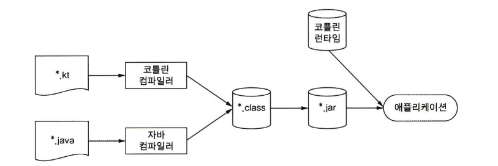

# 1장. 코틀린이란 무엇이며, 왜 필요한가?

- 코틀린은 간결하고 실용적이며，자바 코드와의 상호운용성을 중시한다.

# 1.1 코틀릿 맛보기

코틀린스러운 코드를 한번 확인해봅시다.

```kotlin
data class Person(val name: String,
                  val age: Int? = null)

fun main(args: Array<String>) {
    val people = listOf(Person("영희"),
            Person("철수", age = 29))
    val oldest = people.maxOf { it.age ?: 0 }
    println("나이가 가장 많은 사람 : $oldest")
}
```

느낀점

- data Class를 사용하면 필드값을 외부에서 확인할 수 있다.
- null값으로 필드값을 주어도 람다를 통해 0으로 변경할 수 있다.
- toString을 자동으로 변환해준다.
- 파라미터를 지정할 때 어떤 필드값인지 작성할 수 있다. → 순서 때문에 vo를 생성할 일은 없다.
- list로 변경하는게 아주 편하다. → Java에서는 9부터 가능

# 1.2 코틀린의 주요 특성

코틀린은 특정 대상을 정하지 않고, 모든 애플리케이션에서 작동할 수 있도록 설계되어있습니다.

## 1.2.2 정적 타입 지정 언어

자바와 마찬가지로 코틀린도 정적타입 지정 언어입니다. 정적타입 지정 언어라는 말은 모든 프로그램 구성 요소의 타입을 컴파일 시점에 알 수 있고 프로그램 안에서 객체의 필드나 메서드를 사용할 때마다 컴파일러가 타입을 검증해줍니다. JVM 진영에서는 Groovy가 동적 타입 지정 언어입니다. 타입을 지정하지 않아도 되기 때문에 유연하게 작성할 수 있지만 컴파일 시 걸러낼 수 없기 때문에 실행 시점에 오류가 발생하게 됩니다.

코틀린은 자바와 달리 모든 변수의 타입을 개발자가 지정하지 않아도 됩니다. 대부분 코틀린 컴파일러가 문맥으로 부터 변수 타입을 자동으로 유추할 수 있기 때문에 타입 선언을 생략해도 됩니다.

코틀린은 타입 추론을 통해 컴파일러가 문맥을 고려해 변수 타입을 결정합니다.

```kotlin
var x = 1
```

해당 코드에서 변수를 정의할 때 정수 값으로 초기화 합니다.

정적 타입 지정 언어의 장점은

1. 성능 : 메서드 호출이 더 빠릅니다.
2. 신뢰성 : 컴파일러가 실행 시 정확성을 검증하기 때문에 실행 중 에러 발생할 가능성이 적습니다.
3. 유지 보수성 : 코드에서 객체의 타입을 알 수 있어서 유용합니다.
4. 도구 지원 : 안전하게 리팩터링할 수 있고, IDE의 지원 기능도 잘 만들 수 있습니다.

코틀린의 클래스, 인터페이스, 제네릭은 자바와 비슷하게 작동합니다. 추가로 nullable type을 지원해서 컴파일 시점에 NPE가 발생할 수 있는지 검사할 수 있습니다.

코틀린의 타입 시스템에는 함수 타입에 대한 지원을 합니다.

## 1.2.3 함수형 프로그래밍과 객체 지향 프로그래밍

함수형 프로그래밍의 핵심 개념

1. first class 함수 : 함수를 일반 값처럼 다룰 수 있다. 함수를 변수에 저장하고, 파라미터로 다른 함수에 전달하고, 함수에서 새로운 함수를 반환할 수 있다.
2. 불변성 : 만들어지고 나면 내부 상태가 절대로 바뀌지 않는 불변 객체를 사용해 작성한다.
3. side effect 없음 : 입력이 같으면 항상 같은 출력을 하고, 다른 객체의 상태를 변경하지 않으며, 함수 외부나 다른 바깥 환경과 상호작용하지 않는 순수 함수를 사용한다.

함수형 프로그래밍의 핵심 개념을 활용하면 누릴 수 있는 장점

1. 간결성 : 함수를 값으로 사용할 수 있으면 강한 추상화를 할 수 있고 코드 중복을 막을 수 있다.
2. 스레드 세이프 : 불변 데이터 구조를 사용하고 순수 함수를 적용하면 복잡한 동기화를 적용하지 않아도 된다.
3. 테스트하기 쉽다 : 준비 코드 없이 독립적으로 테스트할 수 있다.

자바는 8버전부터 함수형 프로그래밍을 지원했지만, 코틀린은 처음부터 함수형 프로그래밍을 지원했다.

- 함수 타입을 지원하여 파라미터로 받거나, 함수를 반환할 수 있다.
- 람다식을 지원한다.
- 데이터 클래스로 vo를 간편하게 만들 수 있다.

코틀린으로 코드를 작성할 때는 객체지향과 함수형 접근 방법을 함께 조합해서 문제에 가장 적합한 도구를 사용하면 된다.

# 1.3 코틀린 응용

코틀린은 서버와 안드로이드 개발에 널리 쓰이고 있다.

## 1.3.1 코틀린 서버 프로그래밍

개발자들이 애플리케이션을 수년간 자바로 개발하면서 도움되는 기술과 프레임워크를 엄청나게 만들었습니다. 이런 환경에서 코틀린은 자바와 매끄럽게 상호운용할 수 있기 때문에 여전히 사용할 수 있습니다. 코틀린은 새로운 컴포넌트를 작성하거나 자바 클래스를 코틀린으로 확장해도 아무 문제가 없습니다. 코틀린 클래스 안의 메서드나 필드에 특정 자바 애노테이션을 붙여야하는 경우에도 문제 없습니다.

# 1.4 코틀린의 철학

코틀린은 실용적이고 간결하면서 안전한 언어라고 설명하는 경우가 자주 있습니다.

## 1.4.1 실용성

실제 문제를 해결하기 위해 만들어진 언어입니다. 수많은 소프트웨어 개발자들의 사용에 잘 들어맞을 수 있게 주의 깊게 언어 특성을 선택했습니다. 추가로 초기 코틀린 커뮤니티에서 전달된 피드백이 계속 반영되고 있습니다. 자바에서 사용해 온 익숙한 프로그래밍 기법이나 스타일을 활용할 수 있습니다.

코틀린은 도구를 강조합니다. 좋은 언어만큼 편리한 개발 환경도 생산성 향상에 필수적입니다. 따라서 인텔리J와 컴파일러 개발이 맞물려 이뤄졌습니다.

## 1.4.2 간결성

개발자는 새로운 코드를 짜는 시간보다 기존 코드를 읽는 시간이 더 깁니다. 프로젝트에 합류해서 버그를 수정해야한다면 우선 코드를 읽고 버그를 찾아야 합니다. 코드가 간단하고 간결할수록 내용 파악하기가 쉽습니다. getter, setter, 생성자를 위한 로직 등 자바에 존재하는 번거로운 준비 코드를 코틀린은 묵시적으로 제공합니다.

## 1.4.3 안전성

프로그래밍 언어가 안전하다는 말은 프로그램에서 발생할 수 있는 오류 중에서 일부 유형의 오류를 프로그램 설계가 원천적으로 방지해준다는 뜻이다. 더 큰 안전성을 얻기 위해서는 프로그램에 더 많은 정보를 덧붙여야 하므로 생산성이 하락하는 것을 감수해야하며 안전성과 생산성 사이에는 트레이드오프가 존재한다.

대부분의 경우 코틀린 컴파일러가 타입을 자동 추론하기 때문에 타입 정보를 입력하지 않는다, 더 나아가 컴파일 시점에 더 많은 오류를 방지해준다. 대표적으로 코틀린은 NPE를 없애기 위해서 노력한다.

## 1.4.4 상호 운용성

코틀린의 경우 자바의 기존 라이브러리를 그대로 사용할 수 있다. 코틀린에서 자바 메서드를 호출하거나, 자바 클래스를 상속하거나, 인터페이스를 구현하거나, 어노테이션을 적용하는 일이 모두 가능하다. 자바에서 코틀린 코드를 호출할 때도 아무런 노력이 필요 없다.

# 1.5 코틀린 도구 사용

코틀린도 컴파일 언어다.

## 1.5.1 코틀린 코드 컴파일



코틀린 컴파일러로 컴파일한 코드는 코틀린 런타입 라이브러리에 의존합니다.

인텔리제이를 사용하면 자바에서 코틀린으로 코드를 변경할 수 있습니다.