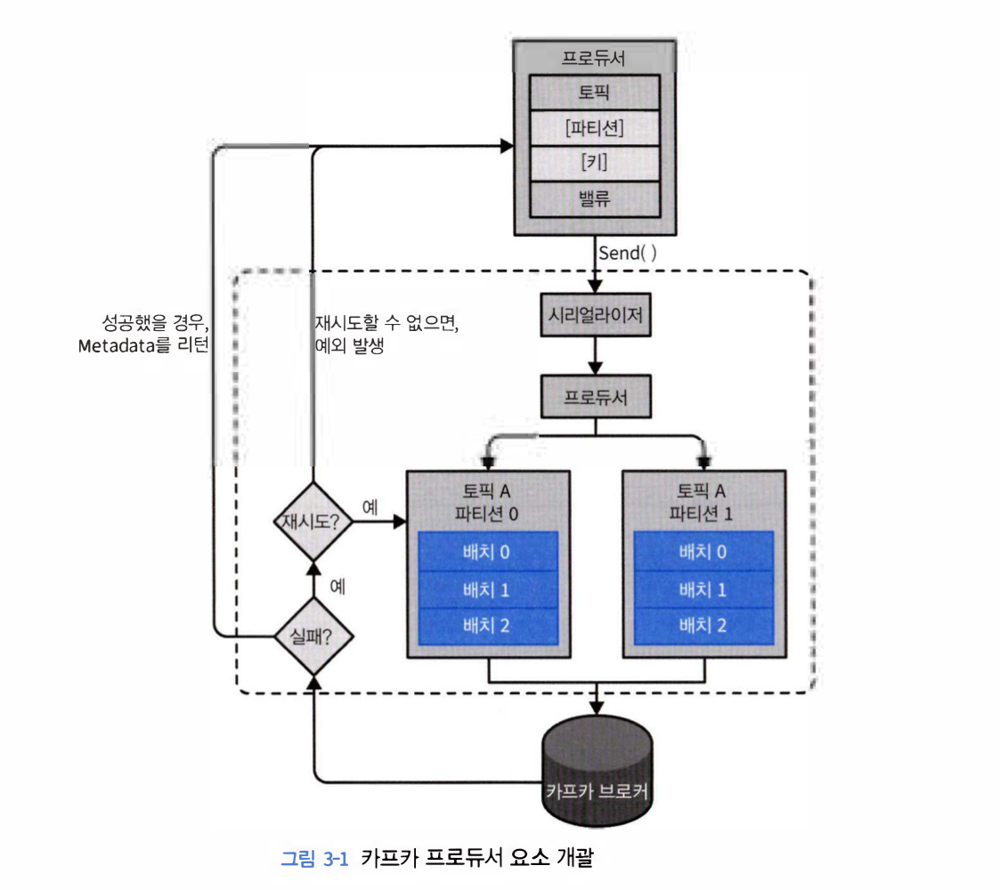

# 3. 카프카 프로듀서: 카프카에 메시지 쓰기

카프카에 데이터를 쓸 때 사용하는 프로듀서나 읽어 올 때 사용하는 컨슈머, 혹은 두 가지 기능을 모두 수행하는 애플리케이션을 생성해야 한다.

## 3.1 프로듀서 개요

카프카에 메시지를 써야하는 상황은 여러 가지가 있을 수 있다.

메시지가 유실이 용납되지 않는 경우, 중복이 허용되지 않는 경우, 반드시 지켜야할 지연율이나 처리율이 있는지 파악해야 한다.

브로커는 메시지를 받으면 응답을 돌려주도록 설정되어 있다.

## 3.2 카프카 프로듀서 생성하기

메시지 전송 방법에는 크게 3가지가 있다.

Fire and Forget: 성공 여부를 신경쓰지 않는다.

Synchronous send : 카프카는 기본적으로 비동기로 작동한다. Future에 get()을 호출하여 작업이 완료될 때 까지 기다린다. 

Asynchronous send: 콜백 함수와 함께 send를 하면 응답을 받는 시점에 콜백 함수가 호출된다.

## 3.3 카프카로 메시지 전달하기

ProducerRecord 객체를 생성하여 전달하면 버퍼에 저장되었다가 별도의 스레드에 의해 브로커로 보내진다.

동기적으로 전달할 경우 get() 을 호출 한다.

비동기적으로 전달할 경우 콜백함수를 같이 보낸다.

## 3.4 프로듀서 설정하기

acks 값을 통해 응답에 대한 반응을 설정할 수 있다.

- 0일 경우: 브로커의 응답을 기다리지 않는다.
- 1일 경우: 리더 레플리카가 메시지를 받을 경우 응답을 받는다
- all일 경우: 모든 레플리카에 전달된 후에 브로커로부터 성공했다는 응답을 받는다.

## 3.5 시리얼라이저

프로듀서를 설정할 때 반드시 시리얼라이저를 지정해주어야 한다.

말 그대로 직렬화하는 데이터의 형식을 맞추기 위함이다.

Custom하게 만들어서 사용할 수 있지만 버전을 맞추기 위해서는 모두가 같은 로직을 사용하고 있어야 한다. 따라서 범용 라이브러리를 사용하는 것을 권장한다.

스키마 레지스트리를 사용하면 시리얼라이저와 디시리얼라이즈간의 버전을 맞춰주는 작업을 할 수 있다.

## 3.6 파티션

## 3.7 헤더

## 3.8 인터셉터

## 3.9 쿼터, 스로틀링

