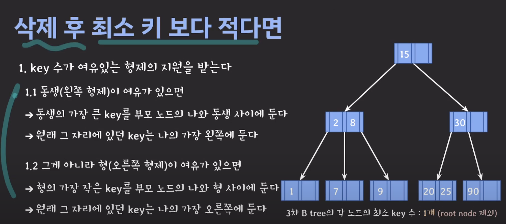
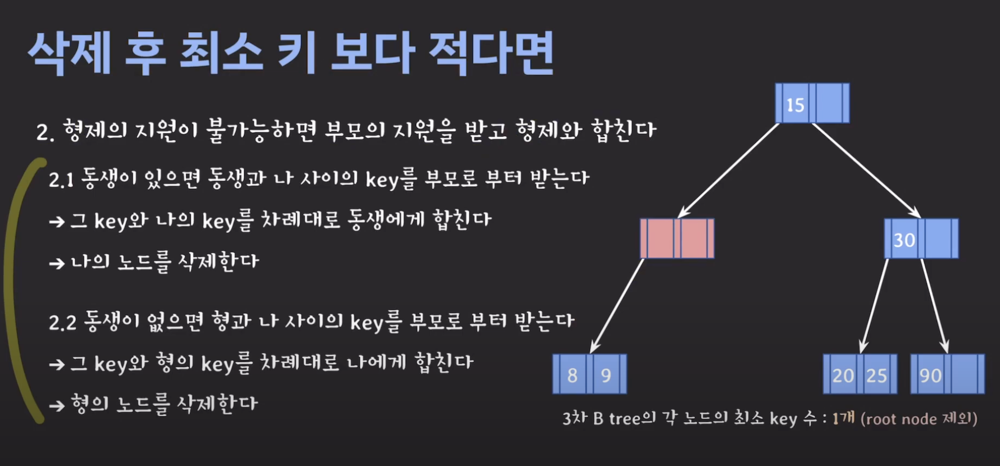
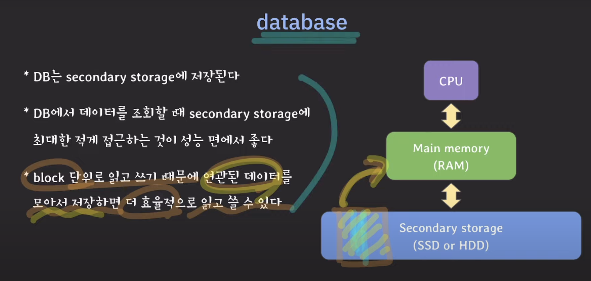

# 개념

 

# 데이터 삽입

- 항상 리프노드에 데이터를 추가하고 만약 노드가 넘치면 median key를 기준으로 좌우를 분할하고 가운데를 승진시킨다.

# 데이터 삭제

만약 이 상태에서 7을 삭제해야 한다면 부모 노드에게서 도움을 받아야 한다.

1. 7을 삭제한다 -> 노드 별 최소 key의 개수를 위반한다
2. 동생 노드(왼쪽 노드)에 2를 내린다.
3. 중간 노드와 왼쪽 노드를 합친다. 지금은 아무값도 없다.
4. 중간 노드를 삭제한다.
5. 부모 노드의 8을 왼쪽으로 당긴다. 

  

# 왜 Btree를 DB 인덱스로 사용하는가?

- Btree 계열과 BST의 밸런스 트리도 모두 O(logN) 복잡도를 가지는데 왜 Btree 계열을 사용하는가?

컴퓨터 구조를 알아야한다!

 

 

 

