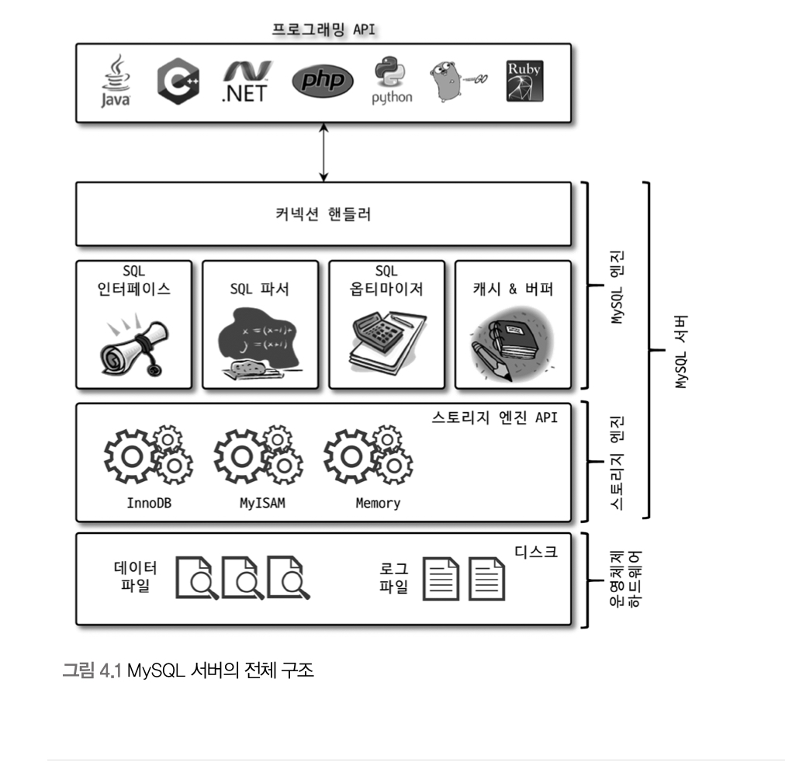
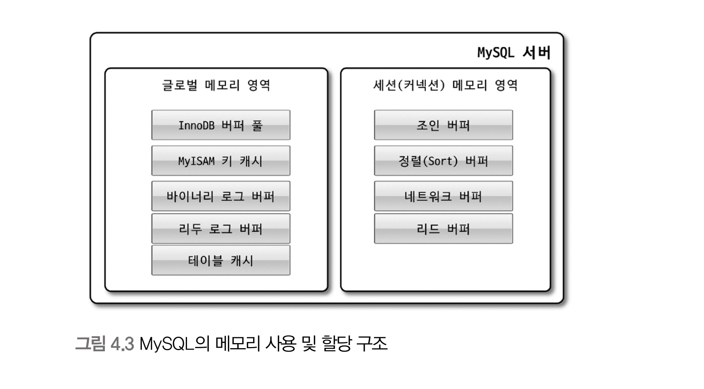
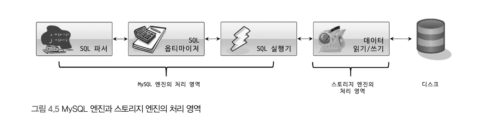
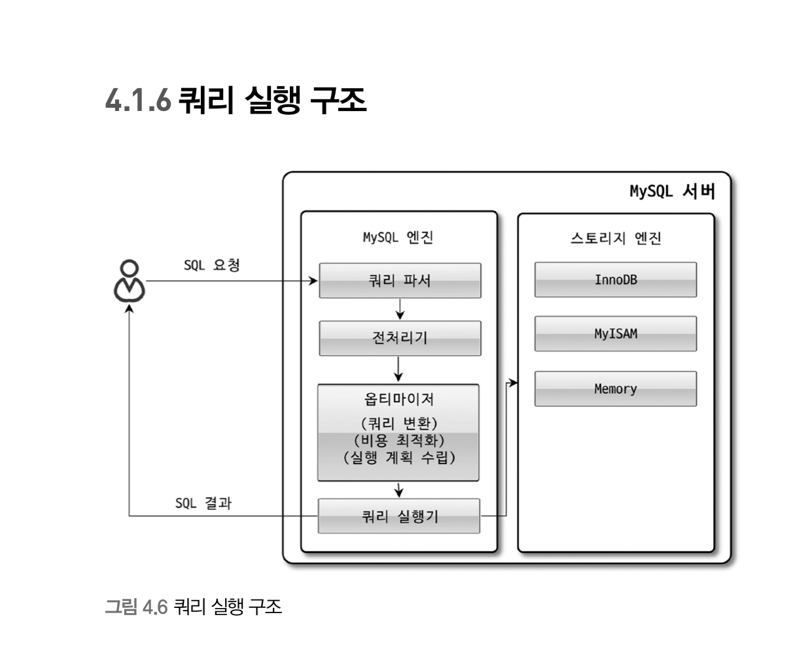

# 소개

- 머리 역할을 담당하는 MySQL 엔진

- 손발 역할을 담당하는 스토리지 엔진

  

1. MySQL 엔진

MySQL 엔진은 클라이언트로부터 접속 및 쿼리 요청을 처리하는 커넥션 핸들러와 SQL 파서 및 전처리기, 쿼리 최적화를 위한 옵티마이저로 구성된다.

2. 스토리지 엔진

실제 데이터를 디스크 스토리지에 저장하거나 스토리지로부터 데이터를 읽어오는 부분은 스토리지 엔진이 담당한다.

3. 핸들러 API

각 스토리지 엔진에 쓰기 또는 읽기를 요청하는데 이러한 요청을 핸들러 요청이라 한다.

---

기본적으로 MySQL 서버는 스레드 기반으로 작동한다.

1. 포그라운드 스레드(클라이언트 스레드)

- 최소한의 MySQL 서버에 접속된 클라이언트의 수만큼 존재한다.

2. 백그라운드 스레드

- 인서트 버퍼를 병합하는 스레드
- 로그를 디스크로 기록하는 스레드
- InnoDB 버퍼 풀의 데이터를 디스크에 기록하는 스레드

## 메모리 할당 및 사용 구조

글로벌 메모리 공간은 MySQL 서버가 시작되면서 OS로 부터 할당된다.

1. 글로벌 메모리 영역
   - 클라이언트 스레드와 무관하게 하나만 할당된다.
2. 로컬 메모리 영역
   - 클라이언트 스레드가 쿼리를 처리하는데 사용하는 영역

## 플러그인 스토리지 엔진 모델

- 사용자가 직접 스토리지 엔진을 개발하는 것도 가능하다.
- 거의 대부분의 작업이 MySQL 엔진에서 처리되고 데이터 읽기 쓰기 작업만 스토리지 엔진에 의해 처리된다.

- MySQL 엔진이 각 스토리지 엔진에게 데이터를 읽어오거나 저장하도록 명력하려면 반드시 핸들러를 통해야 한다.
- MySQL 엔진은 사람, 스토리지 엔진은 자동차라고 하고 조정하는 것을 핸들러라고 생각하자.
- MySQL 서버는 스토리지 엔진뿐만 아니라 다양한 기능을 플러그인 형태로 지원한다.

## 쿼리 실행 구조

1. 쿼리 파서

   쿼리 문장을 토큰으로 분리해서 트리 형태의 구조로 만든다.

   기본 문법 오류는 여기서 확인한다.

2. 전처리기

   쿼리 문장의 구조를 파악한다.

   해당 객체의 존재 여부와 접근 권한을 확인한다.

3. 옵티마이저

   쿼리 문장을 저렴한 비용으로 가장 빠르게 처리할지를 결정한다.

4. 실행 엔진

   핸들러를 통해서 스토리지 엔진을 수행시킨다.

5. 핸들러(스토리지 엔진)

   디스크에 저장하고 읽어오는 역할을 한다.

번외) 쿼리 캐시라는 SQL 실행 결과를 저장해놨다가 즉시 결과를 반영하는 기능이 있었는데 8.0에서 완전히 제거됐다. 거의 사용안되고 동시 성능 처리 저하 등 버그의 원인이었다.

# InnoDB 스토리지 엔진 아키텍처

- InnoDB는 MySQL에서 사용할 수 있는 스토리지 엔진 중 거의 유일하게 레코드 기반의 잠금을 제공하며, 그 때문에 높은 동시성 처리가 가능하고 안정적이며 성능이 뛰어나다.

## 특징

1. PK 에 의한 클러스터링

   PK를 기준으로 클러스터링되어 저장한다.

   모든 세컨더리 인덱스는 레코드의 주소 대신 PK 값을 논리적인 주소로 사용한다.

2. 외래 키 지원

3. MVCC

   잠금을 사용하지 않는 일관된 읽기를 제공하는데 있다.

   언두로그를 통해서 구현한다.

   격리 수준에 따라서 ReadUncommitted는 버퍼풀의 데이터를 반환하고, ReadCommitted 이상은 언두 영역의 데이터를 반환한다.

4. 잠금 없는 일관된 읽기

   다른 트랜잭션의 Lock을 기다리지 않고 일관된 읽기가 가능하다

5. 자동 데드락 감지

   언두 로그 레코드를 더 적게 가진 트랜잭션이 롤백의 대상이 된다.

6. 자동화된 복구

7. InnoDB의 버퍼풀

   디스크이 데이터 파일이나 인덱스 정보를 메모리에 캐시해두는 공간

   LRU에 의해 오래 있는 데이터들은 삭제를 한다.

   서버를 셧다운했다 다시 부팅하면 워밍업을 한다.

## 언두 로그

트랜잭션 격리 수준을 보장하기 위해 DML로 변경되기 이전 버전의 데이터를 별도로 백업한다.

- 트랜잭션 보장
- 격리 수준 보장

트랜잭션이 커밋되지 않아도 데이터 파일은 변경되고, 변경 전값은 언두로그에 작성된다.

8.0부터 언두로그는 시스템 테이블 외에 별도 로그 파일에 기록되도록 개선됐다.

## 리두 로그

D에 해당하는 영속성과 연관돼 있다.

서버가 비정상적으로 종료됐을 때 데이터 파일에 기록하지 못한 데이러르 잃지 않도록 한다.

#### Reference:

Real MySQL 1권