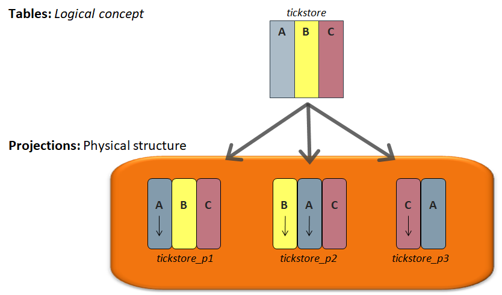

# Vertica DB

MySQL 행 기반의 데이터베이스로 대용량 데이터를 저장하기에는 한계가 있다. 이를 극복하기 위해서 Vertica DB를 사용하고 있다. 2019년 11월 기준 데이터 1억 9천만건으로 한계 도래. 2020년도 초 EP 상품 수가 4억, 5억건으로 증가할 전망

=> Vertica DB 테스트 진행

→ DB 의 장점 ( 원부관리 용이 )

→ 처리속도 매우 빠름 ( select, insert, update, delete )

→ 신규컬럼추가시 영향도 없음

→ Master-Slave 구조가 아닌 클러스터 구조이기에 동기화 지연이 없음

# 컬럼형 DB는 왜 빠른가?

[컬럼형 DB는 왜 빠른가](https://dataonair.or.kr/db-tech-reference/d-lounge/expert-column/?mod=document&uid=52606)

전통적인 데이터 저장구조로는 이것을 처리하는 데 한계점에 다다르자, 매우 빠르게 분석할 수 있는 DBMS인 컬럼형 DB가 출시됐다.

| 구분 | Row 기반 DBMS     | Column 기반 DBMS |
| ---- | ----------------- | ---------------- |
| 특징 | - Row 단위로 저장 |                  |

컬럼형 DB는 Update를 지양하고, Delete → Insert를 지향한다.

(어차피 Update를 해도, Delete + Insert로 나간다)

# Vertica DB 소개

컬럼 지향 DBMS에서 table은 논리적 개념이고 실제 데이터는 Projection에 저장된다. 컬럼별로 조회되기 때문에 불필요한 컬럼을 스캔하는 행위가 줄어들어 디스크 IO가 감소한다.

Table : 버티카의 테이블은 논리적인 구조를 정의할 뿐 실제로 저장되지는 않는다.

Projection: 실제 데이터가 담기는 물리적 구조

## ROS(Read-Optimized Store)

디스크에 상주하는 데이터 저장소로 이를 토애서 VerticaDB는 데이터를 적재한다.

