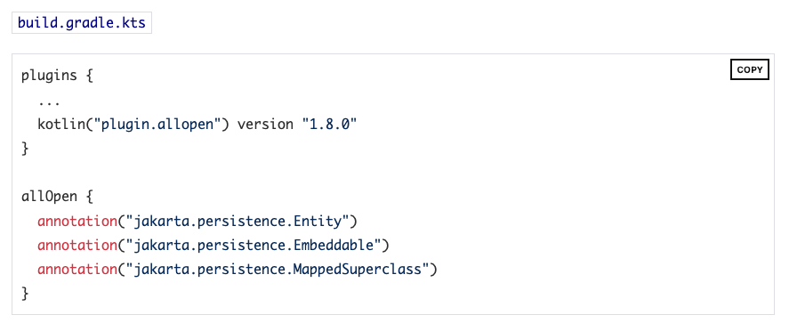
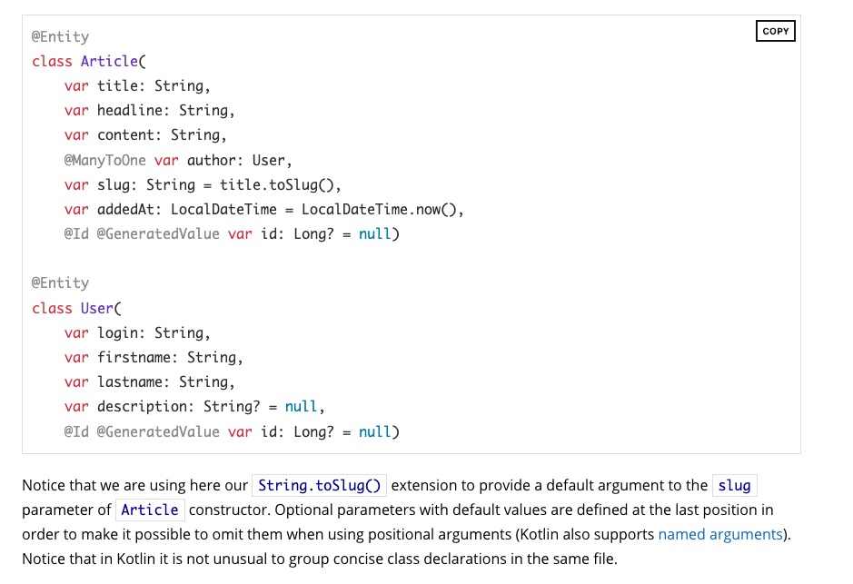

Java에서 Entity를 만들 때 필드값을 final로 지정하지 않았다.

이 이유가 setter를 통해서 값을 주입해줘야되기 때문에 프록시로 관리되어져야해서 라고 생각했다.

그런데 Kotlin에서는 val로 필드값을 갖고 있을 수 있어서 궁금해서 다시 찾아봤다.

# JPA Entity 규칙

1. 엔티티는 무조건 protected 이상의 기본 생성자가 있어야 한다.
2. final이면 안된다. 메서드, 변수들도 모두 final이면 안된다.

https://download.oracle.com/otn-pub/jcp/persistence-2_1-fr-eval-spec/JavaPersistence.pdf?AuthParam=1680080705_d9ff32b740371a49a7b73e67d1d70009

# Kotlin에서 JPA Entity

https://spring.io/guides/tutorials/spring-boot-kotlin/

스프링에서 제공하는 튜토리얼에도 기본적으로 모든 jpa entity들은 open 하도록 설정을 해준다.

만약 nullable한 값이 있으면 제일 마지막에 써주는 것이 좋다.

혹시 위치를 통해 생성자를 사용할 때 잘못 사용할 수 있기 때문이다.

SpringDataJPA를 쓰고 있다면 data class와 val을 같이 사용하지 않는 것을 권장한다.

JPA는 불변 클래스 혹은 메서드와 작동하도록 만들어지지 않았기 때문이다. data class에서 만드는 `equals()` `toString()` 은 권장하지 않는다.

https://www.jpa-buddy.com/blog/best-practices-and-common-pitfalls/