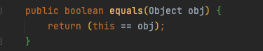
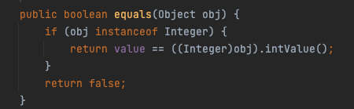
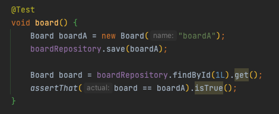
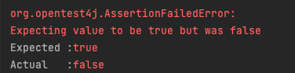
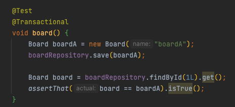
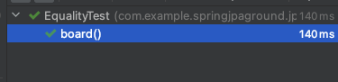
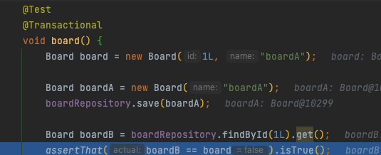
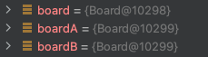

# 소개

JPA Entity가 동일한지 비교할 때 `==` 을 사용해도 동일성을 보장해준다.

영속성 컨텍스트의 이점 중 하나로 같은 참조값을 갖고 있다면 1차 캐시에서 비교를 통해 동일한 값이라고 판단해줍니다.

관련해서 == 을 사용할지 아니면 equals를 사용할지 알아봤습니다.

# 동일성과 동등성

동일성: 동일하다는 뜻으로 두개의 객체가 완전히 같은 경우를 의미합니다. 두 객체가 사실상 하나의 객체로 봐도 무방하며, 주소 값이 같기 때문에 두 변수가 같은 객체를 가리키게 됩니다.

동등성: 두 개의 객체가 같은 정보를 갖고 있는 경우를 의미합니다. 변수가 참조하고 있는 객체 주소가 다르더라도 내용만 같으면 두 변수는 동등하다고 이야기할 수 있습니다.

== 연산자는 객체의 동일성이 판별하기 위해서 사용하고

equals 연산자는 두 객체의 동등성을 판별하기 위해서 사용합니다.

모든 객체의 조상인 Object에서는 == 비교를 하고 있지만 대부분의 구현체들은 이를 재정의하여 사용하고 있습니다.

아래는 Integer에서 재정의된 Equals 입니다.

각 객체에 맞게 동등성을 비교하기 위해서 equals 값을 재정의하여 사용하고 있는 모습을 흔히 볼 수 있습니다.

# JPA에서의 동일성 보장

JPA Entity Manager의 1차 캐시는 Map 형태로 엔티티 인스턴스를 캐싱하고 있습니다.

따라서 같은 Id 값에 대해 매번 같은 인스턴스에 접근하므로 동일성이 보장됩니다.

따라서 `==` 비교를 하더라도 마치 equals에서 동등성을 보장하는 것처럼 보여질 수 있습니다.

하지만 몇가지 예외 상황이 있는데 알아보도록 합시다.

# 예외 사항

1. 다른 Entity Manager에서 관리하는 Entity의 경우

   EntityManager의 생명주기는 Transaction과 동일합니다. 따라서 하나의 트랜잭션 안에서 일어날 경우 공통 1차 캐시를 참조하여 동일성 비교로 동등성 비교의 효과를 낼 수 있지만, 트랜잭션 범위가 달라진다면 문제가 발생할 수 있습니다.

   

   

   해당 테스트는 실패라고 나오는데 이는 트랜잭션 범위가 다르기 때문입니다. 기본적으로 JPA Repository에서 하나의 쿼리에 대해 트랜잭션을 잡아주기 때문에 처음에 저장할 때 사용한 `boardA` 객체와 비교 목적으로 사용한 `board` 객체의 주소값이 달라지게 돼서 false를 return 합니다.

   이를 해결하기 위해서 같은 트랜잭션에 묶으면 해결할 수 있습니다. 동일한 테스트에 선언적 Transactional을 명시해주면 통과하는 것을 볼 수 있습니다.

   

2.  영속화되지 않은 값과 비교하는 경우

   

   

   같은 값을 가지더라도 영속화되지 않는다면 1차 캐시 내부에서 비교값이 없기 때문에 동일한 객체로 바라보지 않고 실패하게 됩니다.

# 정리

따라서 JPA Entity의 동등성을 비교하고자 할 때 만약 ID 값을 기준으로 동일한 객체를 판단하고 싶다면 equals and hashcode를 재정의하여 Id를 기준으로 비교할 수 있도록 하고 되도록이면 `==` 보다는 equals를 쓰는 것을 권장합니다.