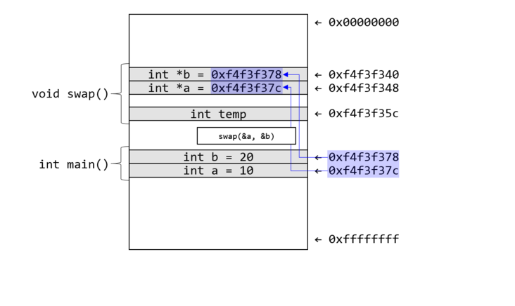

# Call by Value 와 Call by Reference

함수의 매개변수에서 값을 복사하느냐 주소값을 참조하느냐에 따라 반환 결과가 달라지기 때문에 교육과정에서 중요하게 생각한다.

하지만 Refer 타입을 사용했을 때는 주소값이 복사되는 것을 확인할 수 있다.

그렇다면 Java는 둘 다 지원하는게 아닐까?

아니다! Call by Reference는 주소값을 직접 참조하는 것을 의미한다.

Java는 부른다면 Call by Address라고 불러야한다고 한다.

C에서는

그림처럼 주소값을 참조해서 받아올 수 있다.

조작을 하면 main에 있는 값을 변경한다.

