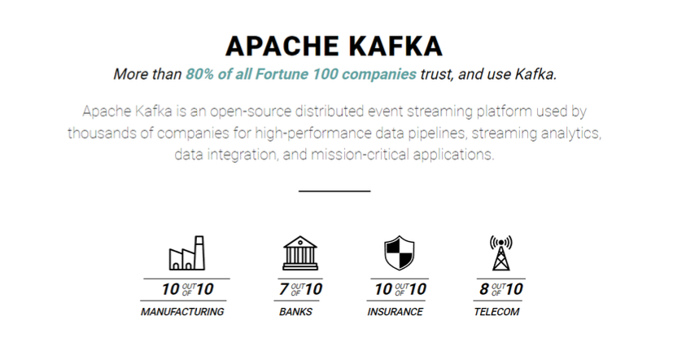
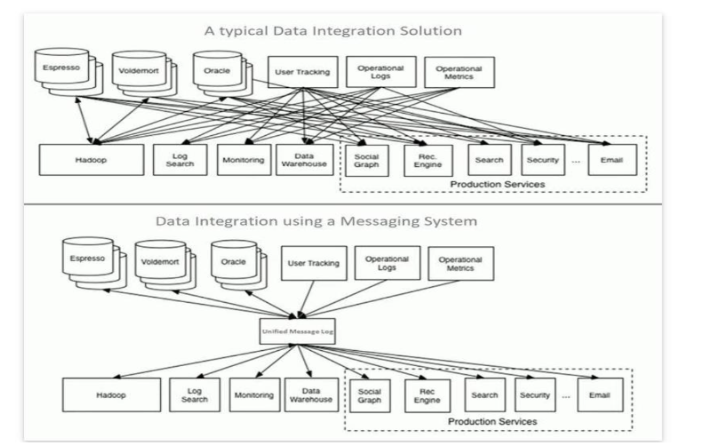

# 소개

미국 상위 100개 중 80%가 카프카를 사용한다.

분산 시스팀이고 이벤트 스트리밍 플랫폼(메세징)

- 데이터 스트림 - 데이터가 끊임없이 들어오는 것을 의미한다.

- 고성능이다.

n to n으로 하지 않고 카프카를 통해서 메세징을 관리해준다.

고성능 데이터 파이프라인 구축의 핵심 역할을 수행한다.

우리나라보다는 외국 기업들이 카프카를 주로 많이 사용한다.

# 왜 카프카를 배워야 하는가

- 좋은 솔루션이고 앞으로도 계속 사용될 것이다.
- 불과 몇년전 수준에서는 상상할 수 없었던 데이터 처리를 기반으로 하는 비지니스 요구사항이 늘어나고 있다.

- 기업 데이터 인프라들을 효율저긍로 통합하고 유연하게 활용하는데 기여하고 있다.