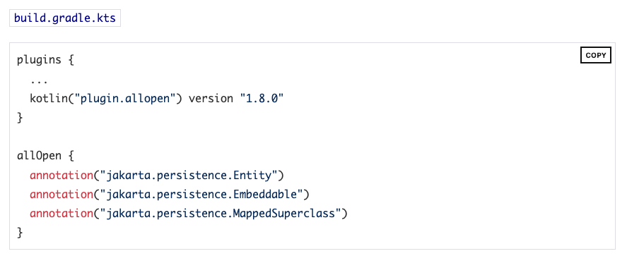
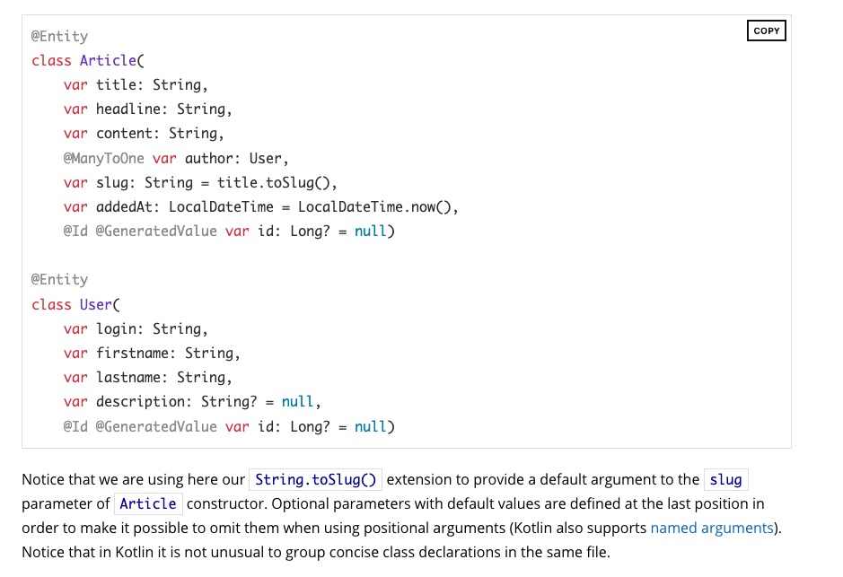

Java에서는 final을 붙일 수 없었다.

Kotlin에서도 Val을 사용할 수 없을 줄 알았는데 사용해도 문제가 없었다.

이는 Kotlin에서 val은 read-only를 부여하는 것이고 immutable 상태로 만드는 것이 아니기 때문이다.

# Kotlin에서 JPA Entity

https://spring.io/guides/tutorials/spring-boot-kotlin/

스프링에서 제공하는 튜토리얼에도 기본적으로 모든 jpa entity들은 open 하도록 설정을 해준다.

만약 nullable한 값이 있으면 제일 마지막에 써주는 것이 좋다.

혹시 위치를 통해 생성자를 사용할 때 잘못 사용할 수 있기 때문이다.

SpringDataJPA를 쓰고 있다면 data class와 val을 같이 사용하지 않는 것을 권장한다.

JPA는 불변 클래스 혹은 메서드와 작동하도록 만들어지지 않았기 때문이다. data class에서 만드는 `equals()` `toString()` 은 권장하지 않는다.

https://www.jpa-buddy.com/blog/best-practices-and-common-pitfalls/

