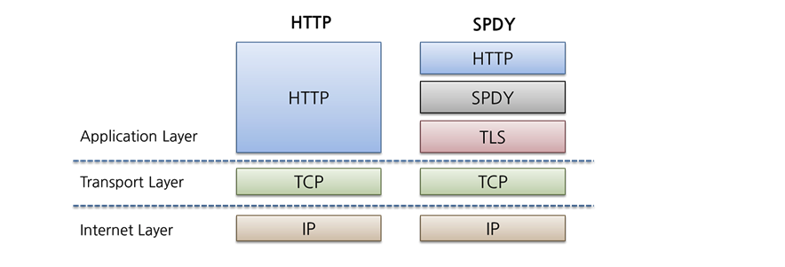
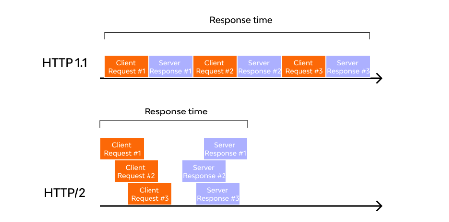
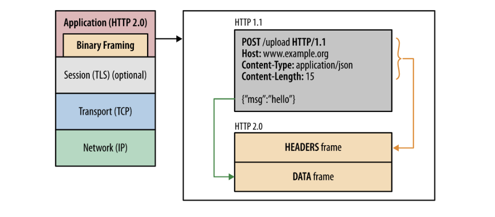
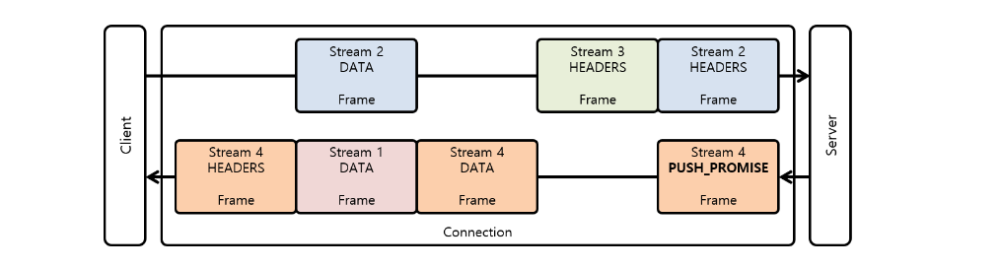
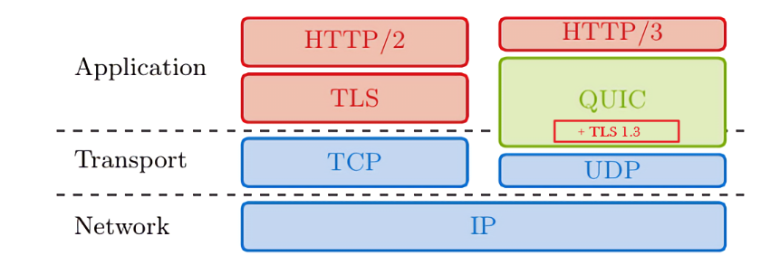
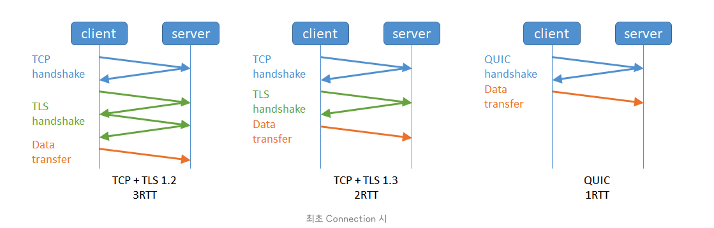

# HTTP?

Hypertext Transfer Protocol은 인터넷에서 데이터를 전송하기 위한 프로토콜입니다.

# HTTP 0.9

최초의 HTTP로 단순히 HTML 문서를 전송하기 위한 용도로 사용되었습니다.

## 특징

- 오직 GET 메서드만 지원합니다.
- HTTP 헤더 X, 상태 코드 X
- 응답도 HTML 파일 자체만 보내준다.
- 서버와 클라이언트 간의 연결은 모든 요청 후에 닫힘

기존 0.9에는 버전 개념이 없었다.

# HTTP 1.0

인터넷 인프라가 빠르게 진화하면서 다양한 요구사항들을 채워야하는 문제가 생겼습니다.

## 특징

- HTTP 메서드 GET, POST, HEAD를 지원합니다.
- HTTP 헤더의 개념 도입
- 상태 코드가 응답 내용과 같이 전달된다.
- Content-Type 으로 HTML 파일 형식 외에 다른 문서들을 전송하는 기능 추가
- 단기 커넥션: Connection 하나 당 1 Request & 1 Response 처리 가능

## 문제점

- Short-lived Connection : 매번 새로운 연결로 성능 저하, html,css,js를 매번 새로 connection을 맺어 받음

# HTTP 1.1

HTTP 1.0을 개선하기 위해 6개월만에 릴리즈한다.

## 특징

- Persistent Connection: 지정한 timeout 동안 커넥션을 닫지 않아서 연속적으로 사용가능 handshake 생략
- PipeLining: 이전 요청에 대한 응답이 완전 전송되기 전에 다음 전송 가능하게
- Host 헤더 추가 : 동일 IP 주소에 다른 도메인을 호스트할 수 있다
- Chunk Encoding 전송: 청크단위 응답 가능

## Persistent Connection (keep-alive)

- TCP 기반으로 3 way handshake로 connection을 맺는다. -> 오버헤드 발생
- 한 번 맺어졌던 연결을 끊지 않고 지속적으로 유지하여 Handshake 성능 개선

<작동 원리>

- 클라이언트 측에서 request에 keep-alive 헤더에 담아서 보낸다

  keep-alive: max는 request 최대 갯수, timeout은 유지되는 시간

  `Connection: close` 로 전달하면 연결을 끊는다.

## PipeLining

요청이 응답될때까지 기다리지 않고 바로 요청을 한꺼번에 보내는 기술

HTTP 2.0에서 멀티플렉싱 알고리즘으로 대체됐다.

## 특징

- keep-alive를 전제로 하며, 서버간 요청의 응답속도를 개선하기 위해 적용
- 서버에서는 FIFO 응답을 반환한다
- 하지만 순서를 보장하다보니 Head Of Line Blocking 문제가 발생해서, 대부분 웹브라우저는 파이프라이닝을 막아놨다.

## 문제점

**Head Of Line Blocking**

- 선입된 데이터 응답 속도가 늦어지면, 후 순위에 있는 데이터 응답속도도 느려진다.

# HTTP 2.0

구글이 만든 SPDY 프로토콜에 기초한다.

성능 향상에 초점을 맞춘 프로토콜이다.

HTTP 1.1까지는 한번에 하나의 파일만 전송가능했다. 파이프라이닝도 HOLB 문제가 있음

2.0부터는 여러파일을 한번에 병렬로 전송한다.

## 특징

- Binary Framing Layer: 1.1때는 텍스트로 전달된 것과는 달리 2.0 부터는 binary frame으로 인코딩되어 전송된다.

  

  헤더와 바디가 layer로 분리된다.

- Stream과 Frame 단위

  1.1에서는 텍스트 message 단위로 구성되어 있었다.

  2.0에서는 Frame, Stream이라는 단위가 추가됐다.

  Frame: HTTP2의 통신 최소 단위 Header or Data

  Message: HTTP 1.1과 마찬가지로 응답 단위

  Stream: 연결된 Connection 내에서 양방향으로 Message를 주고받는 하나의 흐름

- Multiplexing

  

  HTTP 헤더 메세지를 바이너리 형태의 프레임으로 나누고 하나의 커넥션으로 동시에 여러개의 메시지 스트림을 응답 순서에 상관없이 주고 받는 것을 말한다.

  커넥션 낭비도 없고 병렬적으로 자원이 전달되기 대문에 매우 빠르다.

- Server Push

  서버가 미리 필요할 것 같은 리소스를 미리 보낼 수 있다.

- Stream Prioritization

  리소스간 의존관계를 설정하여 HOLB 문제를 해결했다.

- HTTP Header Data Compression

  HTTP 메시지의 헤더를 압축하여 전송한다. 헤더의 내용 중 중복되는 필드를 재전송하지 않도록 설정한다.

## 문제점

- 여전한 RTT(Round Trip Time)

  TCP Handshake의 RTT로 인한 Latency가 여전히 발생한다.

- L3 계층에서의 TCP HOLB를 해결하지 못한다.

# HTTP 3

HTTP2.0은 TCP 기반위에 동작하기 때문에 Handshake에서 발생하는 Latency와 L3 패킷의 HOLB 문제가 발생한다. 이를 보완하기 위해서 HTTP3.0은 UDP 프로토콜을 기반으로 합니다.

구글은 UDP 기반인 QUIC 프로토콜을 고안하여 설계했다.

- QUIC 프로토콜을 도입하여 다중화, 헤더 압축, 서버 푸시를 효율적으로 할 수 있다.

## QUIC 프로토콜(Quick UDP Internet Conections)

- UDP는 신뢰성이 없는게 아니라 탑재를 안했을 뿐이다.
- 커스터마이징이 가능하다.

## 특징

- 연결 시 Latency 감소

  TCP는 1RTT가 필요하고, TLS까지하면 3RTT가 필요하다.

  QUIC는 1RTT로 해결해버린다. 연결 설정에 필요한 정보와 함께 데이터도 보내기 때문이다.

  

- HOLB 현상 해결

  아예 스트림 자체를 독립적으로 여러개로 나누어서 처리한다.

- 패킷 손실 감지에 걸리는 시간 단축

- 더욱 향상된 멀티플렉싱

  독립 스트림으로 성능이 개선됐다.

## 문제점

- 기존 체계 호환성 문제

- 암호화로 제어가 힘듬

  헤더 또한 암호화되기 때문에 ISP에서 네트워크 최적화가 힘들다

- 암호화로 시소스가 많이 든다

- QUIC는 CPU를 많이 사용한다.