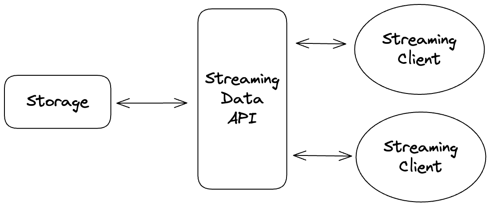
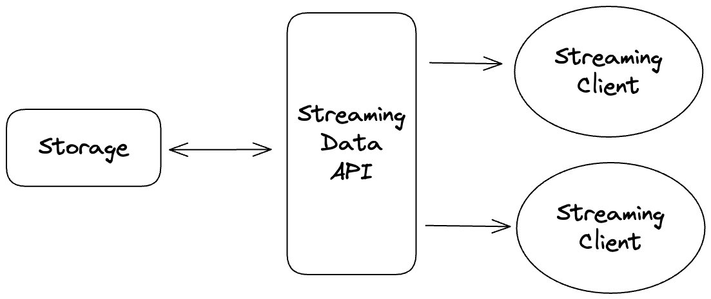
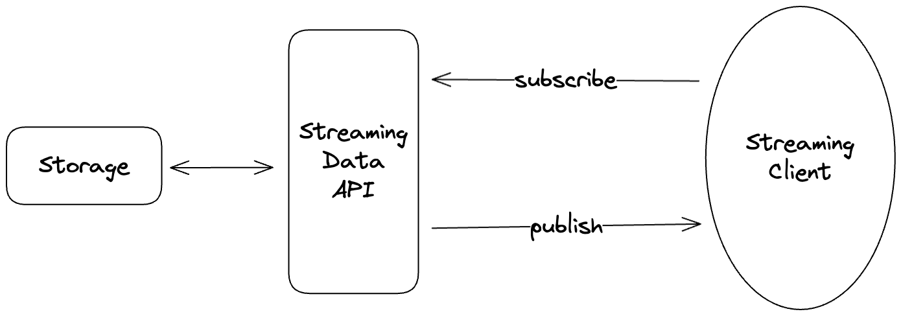
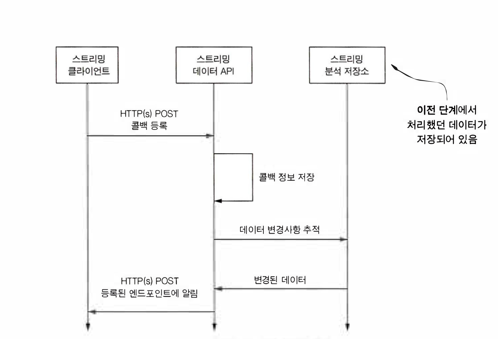
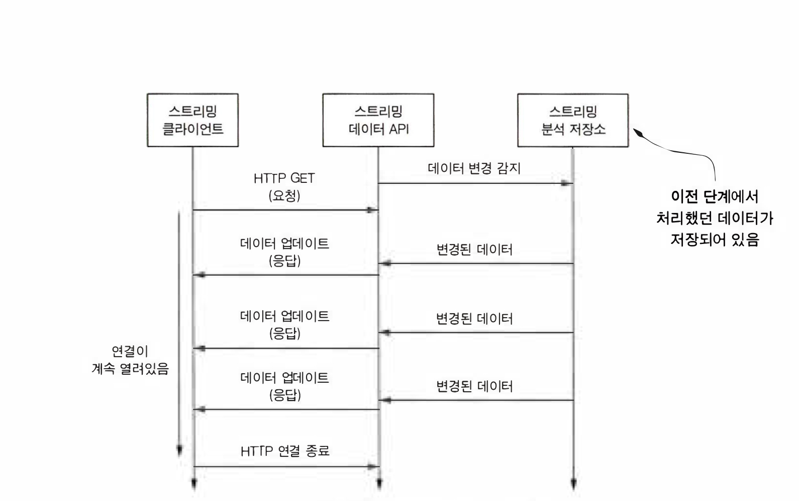
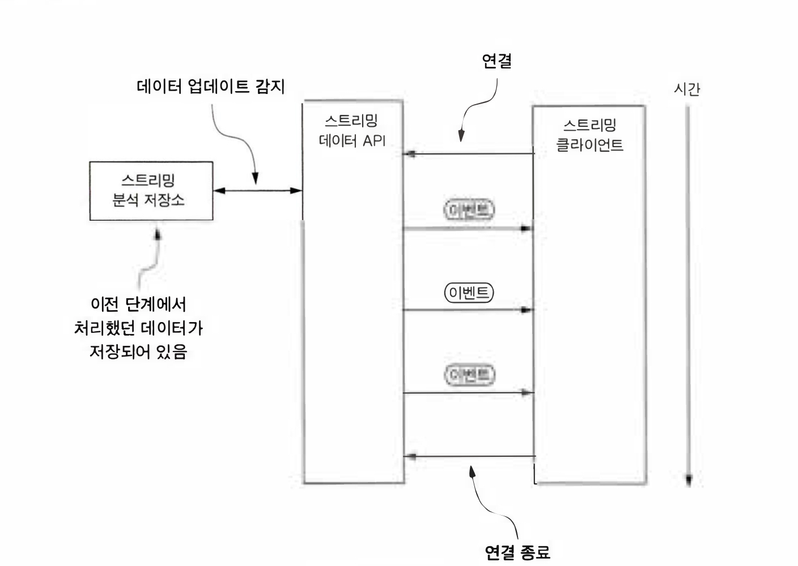
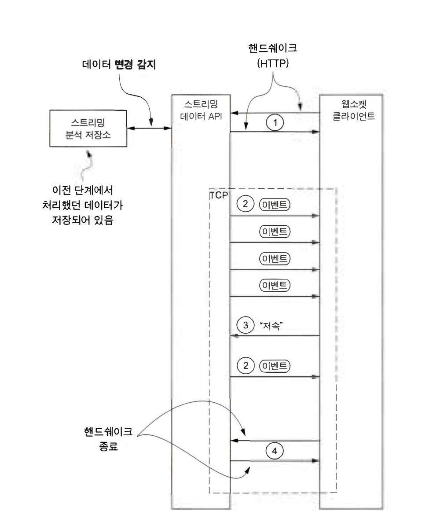

# 소개

스트리밍 아키텍처에 대해서 고민하면서 Consumer와 어떻게 연결을 하는 것이 좋을지에 관해 고민해봤습니다. 사용가능한 네트워크 통신 패턴에 대해서 소개하고, 클라이언트가 데이터를 어떻게 전달받을지 방식에 대해서 소개하겠습니다.

## 네트워크 통신 패턴

클라이언트와 스트리밍 시스템 사이의 네트워크 통신을 할 때는 항상 연속된 처리가 필요한 것은 아닙니다. API를 통해 클라이언트가 데이터를 가져가도록 할지 아니면 서버가 클라이언트한테 푸시할지 고민해야 합니다. 일반적인 푸시, 풀 방식뿐만 아니라 RMI / RPC, 심플 메시징 그리고 PubSub과 같은 패턴들도 있습니다.

### 1. 데이터 동기화

데이터 동기화는 API의 데이터 저장소를 클라이언트와 동기화하는 것입니다. 서버에서 스트리밍 분석을 맞치고 로컬에 저장된 데이터의 변경사항을 감지하여 업데이트를 보내는 방식으로도 작동할 수 있습니다. 이러한 방식이 API 통신과의 차이점입니다.

#### 장점

- 프로토콜이 간단하다
- 클라이언트는 항상 모든 데이터를 최신으로 조회할 수 있다.

#### 단점

- 모든 데이터를 가지기 때문에 전송 시 상당한 대역폭이 필요할 수 있다.
- 데이터의 버전 차이로 충돌 문제가 생길 수 있다.
- 데이터 병합에 대한 정책을 정해야 한다.

### 2. RMI와 RPC

RMI(Remote Method Invocation), RPC(Remote Procedure Call) 패턴은 API 서버에 새로운 데이터가 도착하거나 클라이언트가 필요로 하는 데이터가 도착했을 때, 클라이언트에 있는 메서드를 원격으로 호출하는 방식입니다. 클라이언트와는 단방향으로 이뤄져있습니다.

#### 장점

- 간단한 프로토콜
- 클라이언트의 엔드포인트만 알면 개발 가능하다
- 직관적으로 개발할 수 있는 API

#### 단점

- 장애 감지하기 어렵다 (만약 클라이언트 측에서 장애가 발생하면?)
- 클라이언트에 장애가 발생했을 때 API 서버가 할 수 있는게 없다.

### 3. 심플 메시징

클라이언트는 스트리밍 데이터 API에 최신 데이터를 요청하고 응답을 받습니다. 일반적으로 사용하는 API 통신 패턴입니다. 데이터 동기화와 유사한 구조이지만, Streaming Data API에서 Client 쪽으로는 요청에 대한 응답만 이뤄집니다. 클라이언트가 요청한 결과값이 없을 경우 데이터를 반환하지 않을 때도 있습니다.

#### 장점

- Consumer가 API를 호출하여 간단한 구조를 가진다.
- 항상 최신 데이터만 받을 수 있다.
- API는 클라이언트의 상태에 관여하지 않는다.

#### 단점

- 신규 데이터가 들어왔을 때 클라리언트에 알리는 기능이 없음
- 클라이언트가 종료된 시간이 길거나 대규모 데이터 전송 시 신규 데이터 전송 용량이 급증할 수 있음

### 4. 발행-구독 

PubSub 패턴은 클라이언트가 특정 채널을 구독하고, API가 데이터가 변경될 때 해당 채널을 구독하고 있는 모든 클라이언트에 메시지를 보내는 패턴입니다. 빠른 응답이 필요한 리액티브 프로그래밍이나 스트리밍 시스템에서 많이 활용된다.

#### 장점

- 클라이언트는 새로운 데이터가 도착했을 때만 처리하면 된다
- 클라이언트는 처리한 데이터에 대한 메타데이터를 관리할 필요가 없다

#### 단점

- API 구현을 위한 프로토콜이 필요함
- API는 모든 메타데이터를 추적해야하고, 장애에 대비해 분산해서 저장해야한다..

## 클라이언트에 데이터를 전달하는 프로토콜 방식

스트리밍 API를 개발하기 위해서 기존에 사용되는 프로토콜에 대한 이해가 필요합니다. 일반적으로 사용되는 통신 패턴에 대해서 소개하겠습니다.

### 1. 웹훅

2007년도에 출시한 웹훅은 공식적인 W3C 표준은 아닙니다. 새로운 데이터가 도착하거나 조건이 충족됐을 때 클라이언트를 호출하기 위해 HTTP 엔드포인트로 호출하는 방식으로 사용됐습니다. 이 방식으로 구현할 때는 항상 서버에서 클라이언트로 이동합니다. 콜백 엔드포인트 변경또한 클라이언트 단에서 이뤄져야 합니다. HTTP Post 방식으로 메시지를 전달하므로 HTTP 압축 또는 Chunking을 활용할 수도 있습니다.

단방향으로 이뤄져 메시지 전송을 실패했을 때에 대한 경우 재처리하기가 까다롭습니다, 스트리밍 시스템에는 적절하지 않습니다. 웹훅은 메시지를 누락하더라도 상관없고 데이터 전송량이 적은 시스템에서 많이 사용하는 방식입니다.

### 2. HTTP 롱풀링

HTTP 롱풀링 프로토콜은 클라이언트가 서버에 네트워크 연결이 맺어진 상태로 데이터를 지속적으로 클라이언트에게 보냅니다. 이를 통해 클라이언트는 데이터 변경에 대한 쿼리를 수행할 수도 있습니다. 하지만 이 방식은 스트리밍 API가 모든 클라이언트에 대해 네트워크를 연결한 상태를 유지해야하는 단점이 있습니다.

이 프로토콜은 비동기 프로그래밍 유행에 따른 AJAX의 사용 증가로 흔히 사용되고 있습니다.

### 3. SSE

Server Sent Evnets는 HTTP 롱풀링을 개선하기 위해 개발된 W3C 권장 프로토콜입니다. SSE를 사용하면 HTTP 롱풀링 갖고있는 두가지 이슈를 해결할 수 있습니다.

1. 클라이언트가 지속적으로 네트워크가 연결되고 끊기는 부분에서 발생하는 비효율저인 통신 방식 해결
2. 모바일 디바이스처럼 리소스가 제한된 장치르 사용할 때 푸시 프록시 서버를 통해 유휴 상태에서 메세지 푸시 가능

롱풀링 방식은 클라이언트가 서버에 요청을 보내고 응답이 있을 때까지 연결을 유지하지만, SSE 프로토콜은 서버가 클라이언트로부터 요청을 받지 않습니다. 대신 서버는 클라이언트에게 지속적으로 업데이트를 보냅니다. 따라서 모든 이벤트가 한번 맺어진 네트워크를 통해 지속적으로 전송됩니다. 여전히 네트워크 연결을 유지해야한다는 단점은 존재합니다.

### 4. 웹소켓

2011년에 출시됐고 통신을 위해 TCP를 사용하는 전이중 프로토콜입니다. 웹소켓은 초기 핸드쉐이크와 프로토콜 업데이트 요청에는 HTTP를 사용하고, 이후 통신에는 TCP를 사용합니다. 클라이언트가 데이터를 받기 위해 1개의 TCP 연결만 사용하고 HTTP를 통한 통신이 아니기 때문에 오버헤드가 적다는 장점이 있습니다.

#### SSE와 웹소켓

SSE 또한 강력한 프로토콜이라고 생각합니다. 비록 HTTP 연결이 되는 점이 아쉽지만 HTTP 2.0 이상 버전을 사용한다면 멀티플렉싱을 통해 빠르게 전달될 수 있지 않을까 생각합니다. 단방향 통신으로 이뤄진다면 굳이 웹소켓을 쓸필요 없다고 생각합니다. 예를 들어 주식 실시간 시세처럼 서버에서 지속적으로 이벤트를 업데이트 시켜주고 클라이언트와의 상호작용이 없다면 SSE도 좋은 선택이라고 생각합니다.

# 정리

| 프로토콜    | 메시지 전송 속도 | 통신 방향 | 메시지 지연 시간 | 효율성 | 내결함성/ 신뢰성 |
| ----------- | ---------------- | --------- | ---------------- | ------ | ---------------- |
| 웹훅        | 낮음             | 단방향    | 평균             | 낮음   | 없음             |
| HTTP 롱풀링 | 평균             | 양방향    | 평균             | 평균   | 없음             |
| SSE         | 높음             | 단방향    | 낮음             | 높음   | 추가 개발로 구현 |
| 웹소켓      | 높음             | 양방향    | 낮음             | 높음   | 추가 개발로 구현 |

스트리밍 시스템에서 클라이언트와 API를 연결할 방법에 대해서 알아봤습니다. 항상 그렇듯이 정답은 없습니다, 대략적으로 어떤 기술이 사용되어지고있는지 알아봤고 각 장단점을 살펴봤습니다. 아마 대부분 카프카를 통한 PubSub 구조를 채택한 설계를 가져가는 것 같은데 그 외에 어떤 기술이 있었고 카프카의 장점을 더 알 수 있게된 것 같습니다.

#### Reference

실시간 데이터 파이프라인 아키텍처