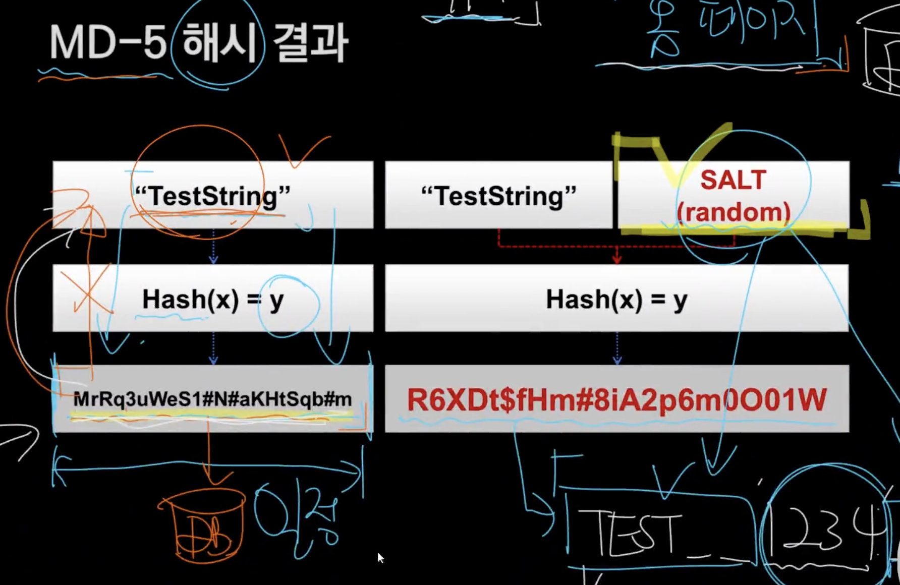

# 특징

- 단방향성
- 입력 값의 크기와 상관 없이 결과 값의 길이(혹은 크기)가 일정
- 데이터 무결성 확보와 관련해 IT 기술 전반에서 사용된다.
- CheckSum에 비해서 완벽하다

# 대표적인 알고리즘

- MD-5 -> 패스워드 단방향 암호화에 사용금지

경우의 수가 적다.

- SHA-1
- SHA-128, 256, 384, 512

숫자가 크면 경우의 수가 커진다

사용자 인증

- 소지: 열쇠
- 지식: 암기(패스워드)
- 생체: 지문
- 위치

회원 : ID + PWD , 를 보통 사용하기 때문에 DB에 저장해야한다. 개발자도 알면 안된다. -> 해시해서 저장해야한다.

# MD-5의 해시 결과

- 원본보다 더 길어진다
- 인증체계 암호화를 하지 마라 -> 길이가 너무 짧다
- 쉽게 뚫을 수 있다. -> 가능한 모든 문자열을 작성해서 브루트포싱해서 찾을 수 있다.
- 보통 SHA-256 쓴다.

- SALT 값을 쓰면 그 시스템을 개발한 개발자들 선만 알고 있기 때문에 탈취당해도 정보를 파악하기 어렵다.

# 활용 사례

- 무결성 확보
- 패스워드 단방향 암호화
- 블록체인

