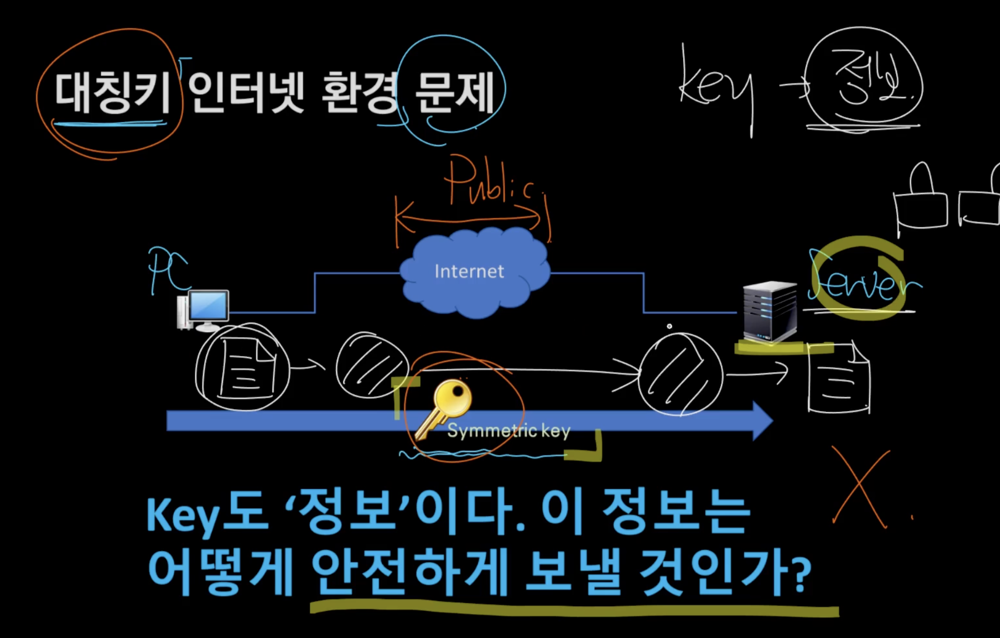
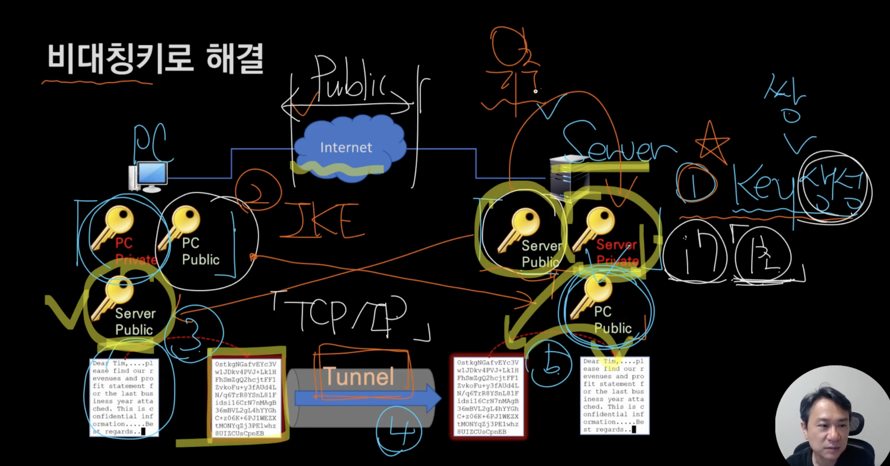
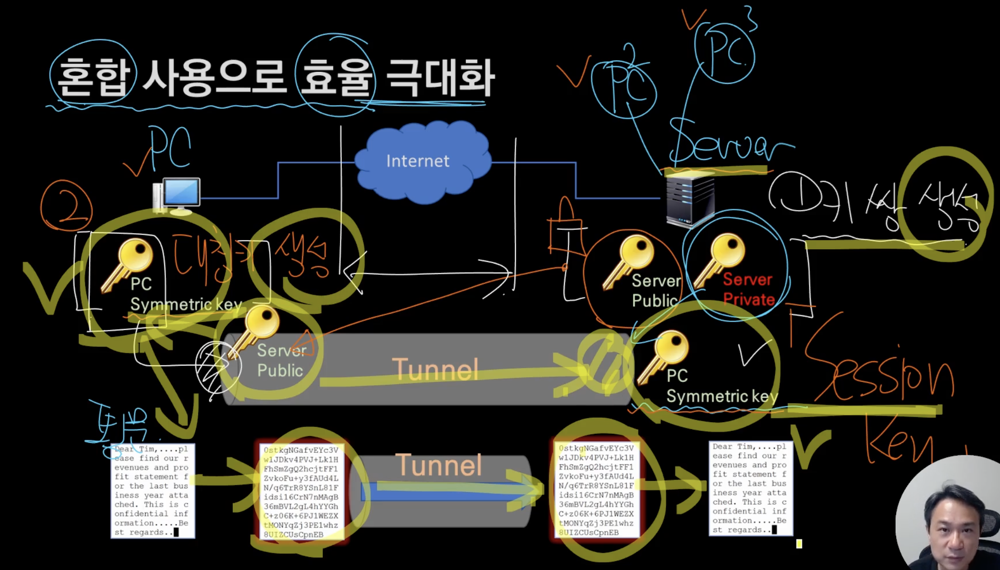
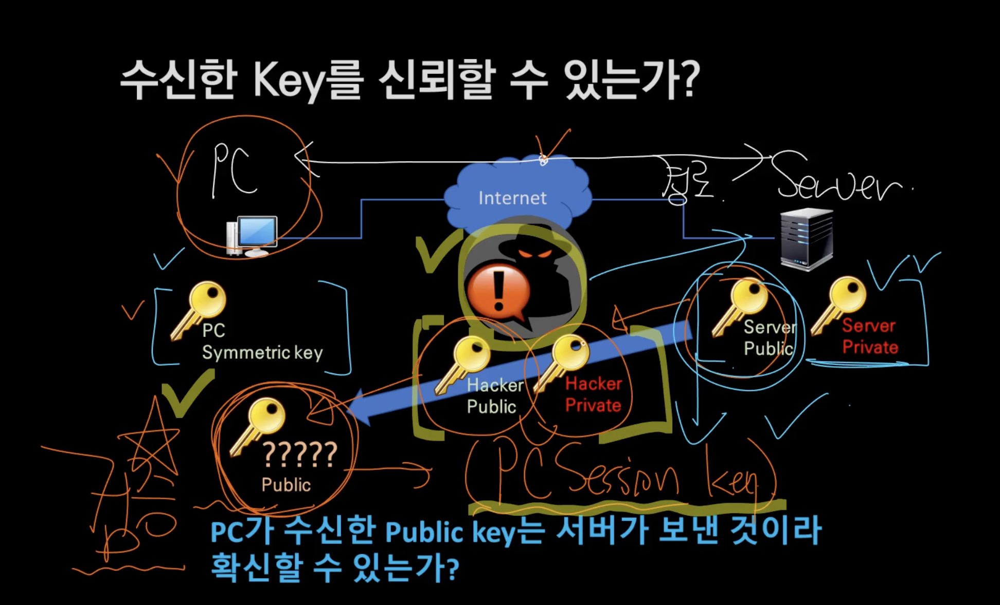
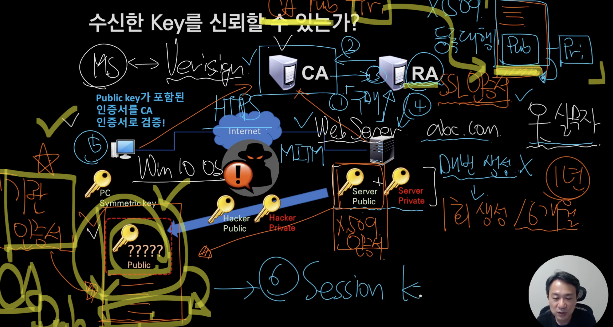
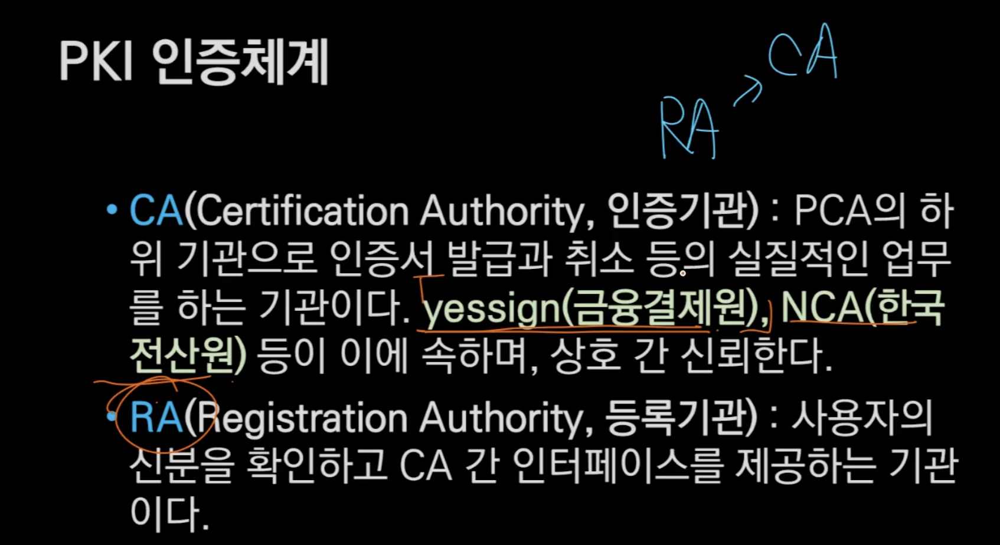
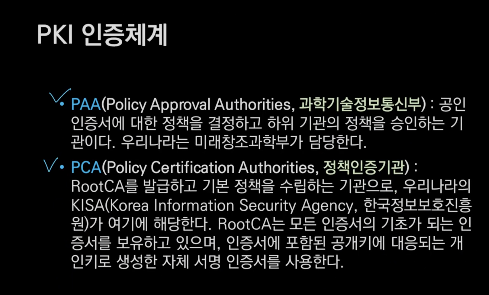

대칭키로 통신하는 것은 불가능 하다 -> 키를 안전하게 보낼 수 없기 때문이다.

1. 키 쌍을 생성한다.
2. Internet Key Exchange -> 상대방에게 Key를 보낸다.
3. 이를 안전하게 교환하기 위해서 Tunnel을 만든다. 비유적인 표현이고 TCP/ IP다

비대칭키는 대칭키가 효율적이지만 보안 차원에서 나온 개념이다.

<문제점>

- 이 방법의 문제는 RSA-2048 키쌍을 생성하는데 시간이 오래걸린다는 것이다. 비밀 통신을 할 때마다 만들어야하기 때문에 부하가 너무 심하다.
- PublicKey로 PrivateKey를 유추할 수 있다.

# 효율 극대화를 위한 혼합 사용

- Client 측에서는 비대칭키가 아닌 대칭키를 만들어서 사용하면 효율을 극대화시킬 수 있다.

1. Server는 비대칭키를 생성하고, Client는 대칭키를 생성한다.
2. Server는 Client에게 Server PublicKey를 전달한다.
3. Client는 대칭키를 Server PublicKey로 암호화해서 Server에게 전달한다.
4. Server는 Server PrivateKey로 복호화해서 Client 대칭키를 획득한다 이를 SessionKey라고 부른다.

# 비대칭키 체계의 문제점

Client 측에서는 Server가 보낸 PublicKey의 출처를 알 방법이 없다.

중간자 공격을 당하면 마치 서버와 통신하고 있는것처럼 보이지만 중간자가 껴서 해커가 내용을 탈취할 수 있다.

# 공개키 신뢰를 위한 검증 체계

내용 증명 :

발신자와 수신자 사이에 검증해주는 사람이 낀다. 예를 들어 우체국에서 같은 기록을 갖고 있는다.

우체국의 역할을 CA가 하게 된다.

Server는 비대칭키를 스스로 만들지 않고, RA에게 구매를 한다.

<비대칭키 구입 과정>

1. RA에게 구매 요청을 한다 -> 6개월/ 1년이 있는데 보통 1년짜리를 구입한다.

2. RA는 CA에게 해당 도메인에 대한 정보를 보낸다.

3. CA는 이를 등록하고 생성한 PublicKey와 PrivateKey를 보내준다.

   이때 PublicKey를 SSL 인증서라고 한다.(x.509 인증서)

4. Server는 비대칭키 한 쌍을 얻는다.

<클라이언트와의 연결>

1. Server의 PublicKey를 전달한다.

2. Client는 OS에서 기관인증서의 PublicKey를 가지고 있다.

   Windows 면 MS에서 이를 매번 업데이트해준다.

3. Client는 CA의 PublicKey를 이용해서 Server PublicKey의 암호화된 Hash를 복호화한다.

4. Client는 Server PublicKey의 내용을 Hash해서 복호화한 값이랑 비교해서 위변조를 확인한다.

5. SessionKey를 서버에게 전달한다.

CA를 민간에게 풀어서 이제 네이버나 카카오 인증이 가능해진 것이다.

