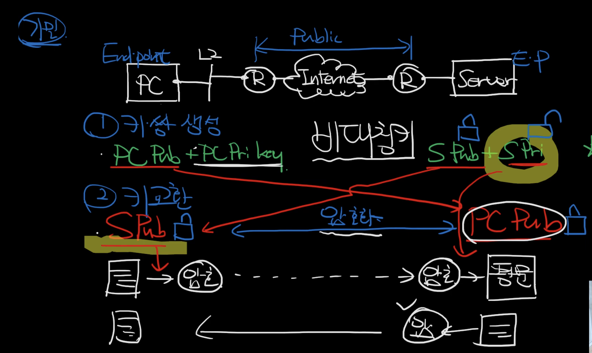

- HTTP는 평문을 보내는 과정이라 네트워크 도중에 탈취당할 가능성이 항상 존재한다.
- 이를 어떻게 안전하게 보낼 수 있을까에 대한 기본적인 개념이지만 이대로 사용하는 경우는 없다

1. Client와 Server 각각 비대칭키를 생성한다.
2. Client와 Server는 서로의 Public Key를 주고 받는다.
3. Client는 평문을 Server의 Public Key로 암호화해서 전달한다.
4. Server는 해당 내용을 Server의 Private Key로 복호화한다.
5. Server는 응답을 Client의 Public Key로 암호화해서 전달한다.
6. Client는 Private Key로 해당 내용을 복호화한다.

출처: https://www.youtube.com/watch?v=jyZ7TQaFy_o