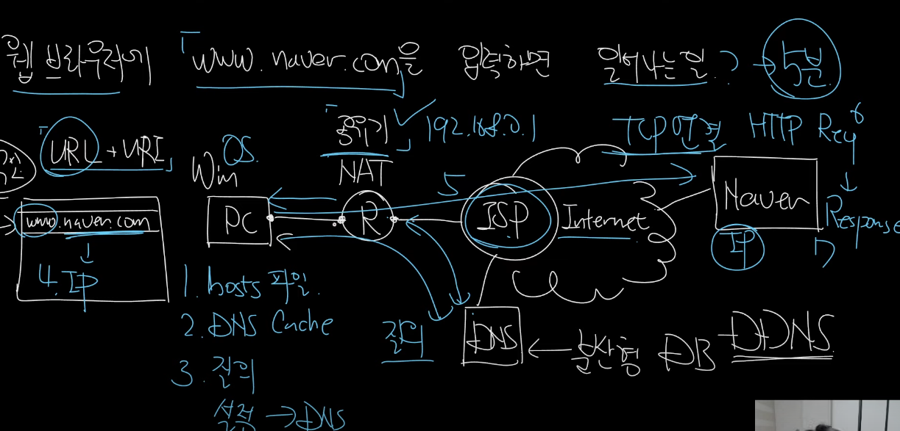

- 윈도우 환경에 공유기라고 가정한다.
- DNS 관련해서도 설명했다.
- URL과 URI의 차이, 위치지정자 vs 식별자




1. hosts 파일 찾음
2. 운영체제가 질의를 한 적이 있으면 DNS Cache가 있다. Cache를 조회
3. 질의를 한다.
   1. 설정에 따라서 공유기에 조회할 수도 있다.
4. PC 설정에 따라서 DNS에 질문한다.
5. 설정을 안했으면 ISP한테 질의한다.
6. 이후에 DNS 연결한다.
7. Naver에 TCP 연결을 한다.
8. Request
9. Response한다.

구글이나 네이버 정도면 GSLB가 되어있다. + CDN

CDN - Alcamai, KT 등

CDN을 사용하는 이유를 말한다.

GSLB를 구현한다. DNS, System(DNS) + HealthCheck

```bash
❯ nslookup www.naver.com
Server:		8.8.8.8
Address:	8.8.8.8#53

Non-authoritative answer:
www.naver.com	canonical name = www.naver.com.nheos.com.
www.naver.com.nheos.com	canonical name = www.naver.com.edgekey.net.
www.naver.com.edgekey.net	canonical name = e6030.a.akamaiedge.net.
Name:	e6030.a.akamaiedge.net
Address: 23.40.44.189
```

반환하는 주소는 AKAMAI 주소를 반환한다.

.png)

IP 주소가 달라질 수 있다.

.png)

.png)

1. CDN을 썼을 떄 접속자의 IP주소를 보고 위치를 파악한다.
2. 서울에서 접속하고 있구나
3. naver.com가 n개 있음 서울에서 원활하게 접속할 수 있는 주소를 반환한다.
4. 서울이 다운되도 다른 서버에서 반환해준다.

Login이 실패하면 어떻게 대응할 것인가?