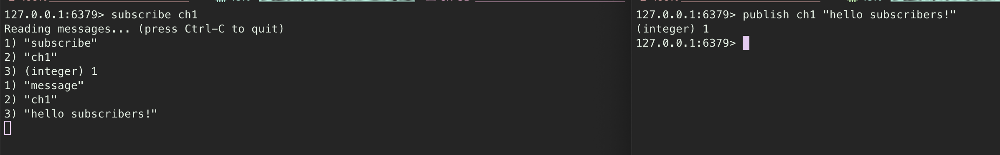

# 분산락?

공유 자원에 대해 경쟁 상태가 발생하지 않도록 처리가 필요하다. 서버를 다중화한 분산환경에서 상호 배제를 구현하여 동시성 문제를 다루기 위해서 분산락의 개념이 등장했다.

분산 락을 구현하기 위해서는 락에 대한 정보를 어디에 공통적으로 보관하고 관리할 수 있어야 한다.

# Redis의 Atomic 연산자

Redis는 SETNX 함수를 제공한다.

`Set if Not Exists` 의 줄임말이다. Key에 Value가 존재하지 않을 때만 값을 설정할 수 있다는 의미다.

Redis를 통해서 가볍게 스핀락을 구현하는 방법은 해당 연산자를 계속 콜하는 것이다. 값이 반환될 때 까지 계속 요청을 한다.

Timeout을 걸어서 데드락 방지하고 혹여나 네트워크 상의 문제로 락을 취득하지 못할 때 다른 락 획득 요청이 진행될 수 있도록 한다.

정상적으로 작업을 종료했으면 DEL을 호출하여 락을 해제한다.

# Redis Pub/Sub 활용

Redis를 메시지 큐처럼 사용할 수도 있다.

채널을 만들어서 해당 채널을 구독할 수도 있고, 채널에 메시지를 발행할 수도 있다.

좌측에서 채널을 구독하고 있고, 우측에서 채널에 메시지를 발행하면 전달되는 것을 볼 수 있다.

이를 이용해서 어떻게 구현할 수 있을까?

락을 취득한 경우, 특정 키를 `SETNX`로 값을 지정한다. 성공했을 경우 Pubsub 채널을 구독하고 끝냅니다.

만약 락을 취득하지 못했을 경우, timeout 기간 동안 Thread를 재워둡니다.

락을 해제할 때는 값을 `DEL` 을 통해 값을 삭제하고 subscribers에게 메시지를 발행합니다.