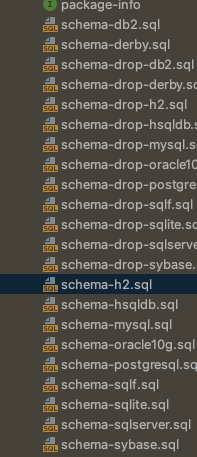
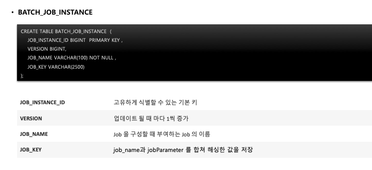
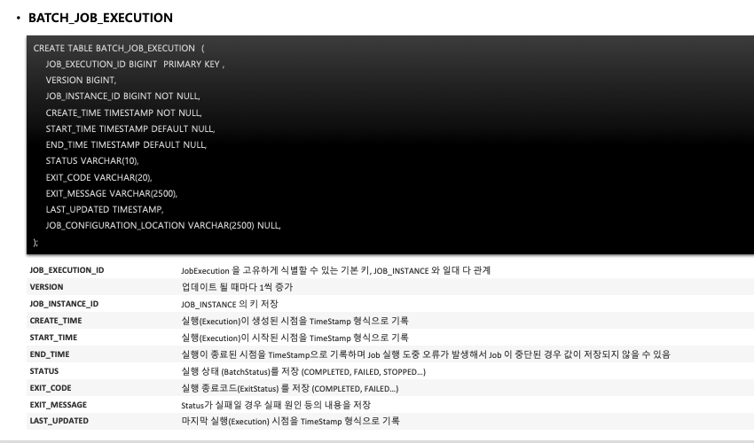
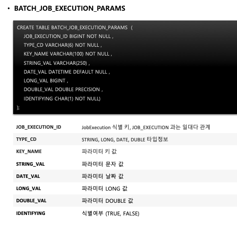
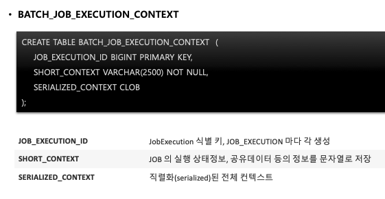
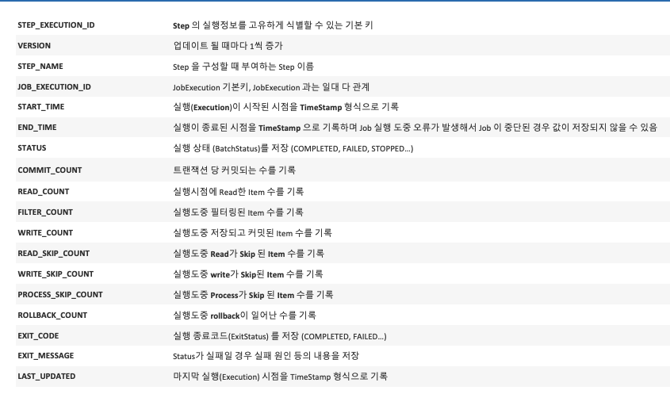
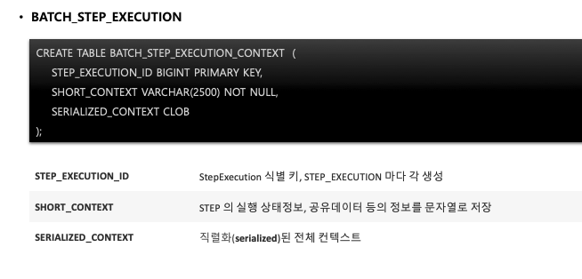

- 스프링 배치가 알아서 DB 스키마를 설치하고 여러 도메인들의 정보를 저장하고 업데이트 한다.

- /org/springframework/batch/core/schema.sql 에 위치함.

  

- Initialize-schema = always 일 경우 schema를 알아서 생성한다.
- Embedded, never 도 있음

### Job 관련 테이블

1. Batch Job Instance

   - Job이 실행될 때 정보가 저장된다.

   - 동일한 job_name과 job_key로 중복 저장할 수 없다.

   

2. Batch Job Execution

   - Job 관련 실행 정보를 저장함

     

3. Batch Job Execution Params

   - jobParameter 정보 저장

     

4. Batch Job Execution Context

   - Job의 실행동안 여러가지 상태정보

   - Step 간 공유 가능

     

### Batch 관련 테이블

1. Batch Step Execution

   Step의 실행정보가 저장됨

   

2. Batch Step Execution Context

   - Step 실행동안 상태 정보 저장
   - Step 끼리 공유 불가능

   

