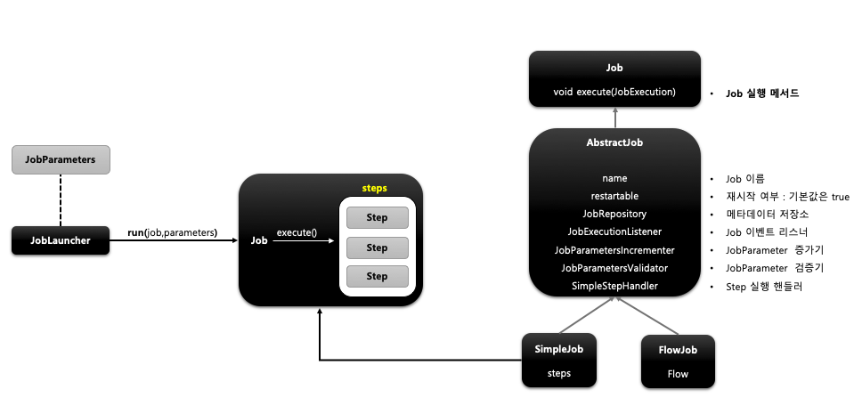
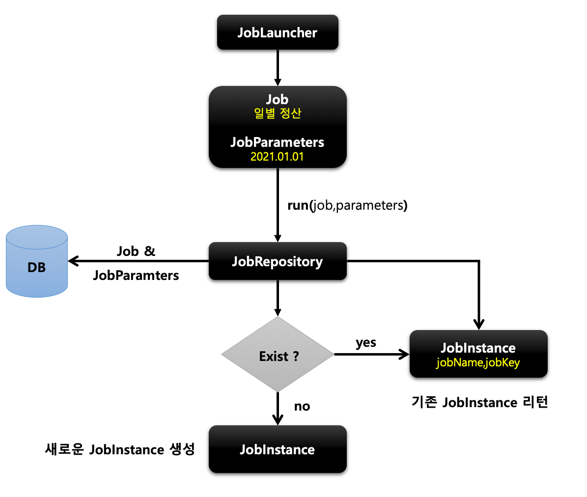
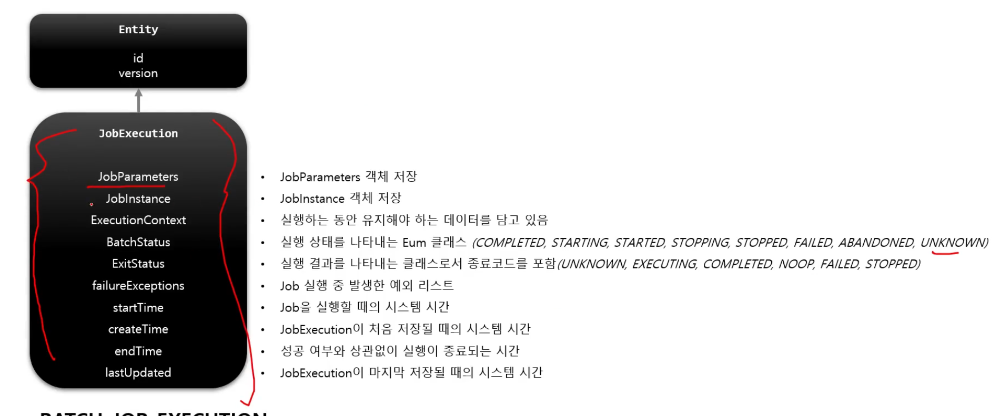
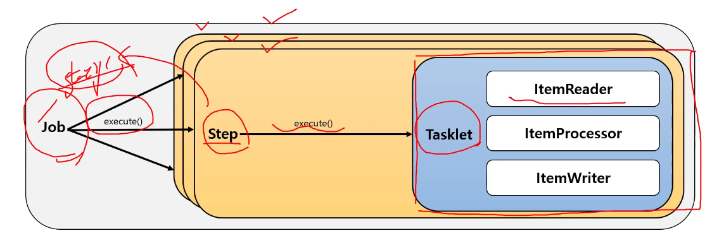
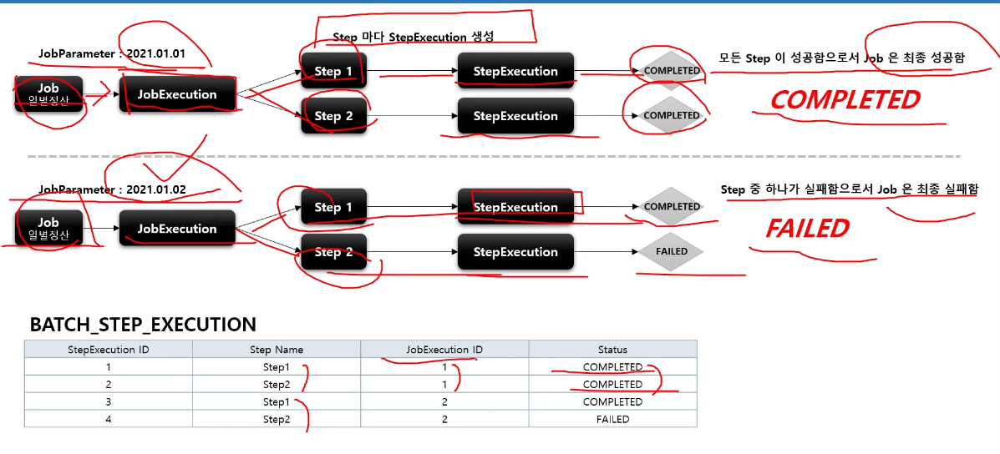

# Job

- 배치 계층 구조에서 가장 상위에 있는 개념으로 하나의 배치작업 자체를 의미함
- Job Configuration을 통해 생성되는 객체 단위로 배치 작업을 어떻게 구성하고 실행할 것인지 설정하고 명세한 객체
- 최상위 인터페이스며, 스프링 배치가 기본 구현체를 제공한다.

- 여러 Step을 포함하고 한개 이상의 Step으로 구성해야함

Simple Job

- 순차적으로 실행하는 Job
- 모든 Job에서 유용하게 사용할 수 있는 표준 기능

FlowJob

- 특정한 조건과 흐름에 따라 Step을 구성하여 실행하는 Job
- Flow 객체를 실행시켜서 작업을 진행함

- 처음 Job + JobParameter 일 경우 새로운 JobInstance 생성
- 이전과 동일한 Job과 Parameter라면 이미 존재하는 JobInstance 리턴
  - 내부적으로 JobName과 JobKey를 가지고 JobInstance 객체를 얻음

# JobParameter

- Job을 실행할 때 함께 포함되어 사용되는 파라미터를 가진 도메인 객체
- JobParameters와 JobInstance는 1:1 관계

생성하는 방법 3가지

- 앱 실행시 주입
- 코드로 생성
  - JobParameterBuilder
- SpEL 이용
  - @Value("#{jobParameter[requestDate]})

# JobExecution

- JobInstancedㅔ 대해 한번의 시도를 의미하는 객체 Job 실행 중에 발생한 정보를 저장하는 객체

- `Completed` 와 `Failed` 로 갖고 있는다.
- `COMPLETED` 면 재실행 불가능하다.

# Step

## 1. 기본 개념

- Batch Job을 구성하는 독립적인 하나의 단계
- 실제 배치처리를 정의하고 컨트롤하는 데 필요한 모든 정보를 가지고 있는 도메인 객체
- 복잡한 비지니스 로직을 포함하는 모든 설정들을 갖고 있다.
- 모든 Job은 하나 이상의 step으로 구성됨

## 기본 구현체

- TaskletStep
  - 가장 기본이 되는 클래스
- PartitionStep
  - 멀티스레드 방식으로 Step을 여러개로 분리해서 실행
- JobStep
  - Step 내에서 Job을 실행하도록 한다.
- FlowStep
  - Step 내에서 Flow를 실행하도록 한다.

- Job 이 호출된다.
- 순서대로 작성된 Step이 실행된다.

TaskletStep

- Tasklet에 구성된 task가 실행된다. or ChunkOrientedTasklet을 실행 시켜서 Chunk 기반의 실행도 가능하다.

JobStep

- Step에서 Job을 실행

# StepExecution

## 1. 기본 개념

- Step 에 대한 한번의 시도를 의미하는 객체로 Step 실행 중 발생한 정보들을 저장하고 있는 객체
- 매번 시도될 때 마다 각 Step 별로 생성된다.
- Job이 재시작하더라도 실패한 Step만 실행된다.
- Step이 실제로 시작됐을 때만 StepExecution을 생성한다.

- JobExecution과의 관계

  - StepExecution이 모두 성공해서 정상적으로 완료된다.
  - 하나라도 실패하면 JobExecution은 실패한다.

  

## 2. Batch_step_execution 테이블

- 하나의 Job에 여러개의 Step이 있을 경우 각 StepExecution은 하나의 JobExecution 부모를 갖는다

