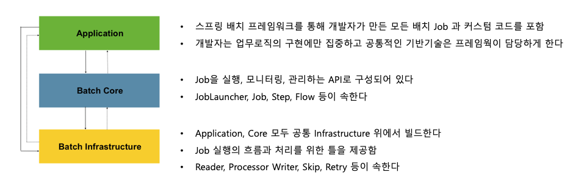
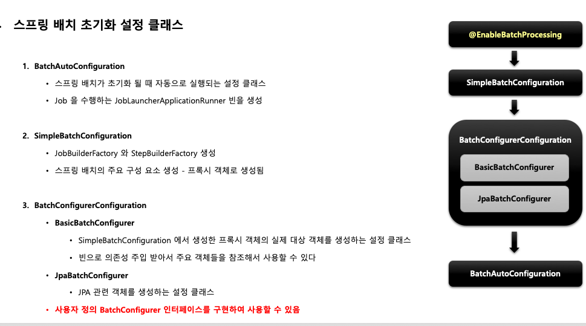

# 스프링 배치

스프링 배치 소개, 배치 시작, 도메인 이해, 배치 실행

# 개요

1. 스프링 배치 탄생 배경

   - 자바 기반 표준 배치 기술 부재

   - IO, Network, TCP 등 자바 표준이 있다 JSR-xxx

​	SpringBatch는 Accenture + SpringSource에서 합작함

​	Accenture에서 주로 만듬

2. 배치 핵심 패턴

   - Read - DB, File, Queue 등에서 다량의 데이터 조회

   - Process - 특정 방법으로 데이터 가공

   - Write - 데이터를 수정된 양식으로 다시 저장

DB의 ETL(Extract-Transform-Load)과 동일하다.

3. 배치 시나리오
   - 배치 프로세스를 주기적으로 커밋
   - 동시 다발적인 Job의 배치처리, 대용량 병렬처리
   - 실패 후 수동 또는 스케쥴링에 의한 재시작
   - 의존관계가 있는 Step 여러개를 순차적으로 처리
   - 조건적 Flow 구성을 통한 체계적이고 유연한 배치 모델 구성
   - 반복, 재시도, Skip 처리

