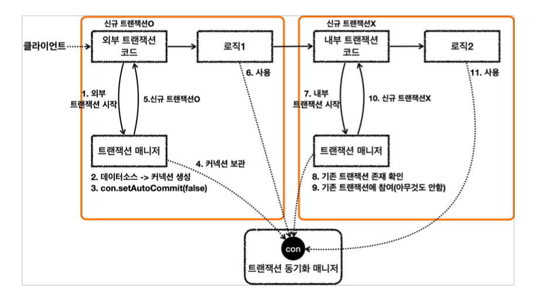

트랜잭션이 이미 진행중인데, 여기에 추가로 트랜잭션을 수행하면 어떻게 될까?

트랜잭션의 옵션에 따라 다르게 동작한다.

스프링은 물리 트랜잭션과 논리 트랜잭션으로 개념을 나눈다.

- 물리 트랜잭션은 실제 데이터베이스에 적용되는 트랜잭션을 뜻한다
- 논리 트랜잭션들은 하나의 물리 트랜잭션으로 묶인다.

원칙

- 모든 논리 트랜잭션이 커밋되어야 물리 트랜잭션이 커밋된다.
- 하나의 논리 트랜잭션이라도 롤백되면 물리 트랜잭션은 롤백된다.

---

트랜잭션 참여

- 내부 트랜잭션이 외부 트랜잭션과 같은 트랜잭션을 사용한다.
- 내부 트랜잭션은 commit해도 아무 로직 수행하지 않는다.

트랜잭션 매니저는 커밋 시점에 신규 트랜잭션의 여부에 따라서 다르게 동작한다. 신규 트랜잭션은 실제 커밋을 호출한다.

내부 트랜잭션이 커밋되더라도, 외부 트랜잭션이 롤백되면 전부 롤백된다.

만약에 내부에서 롤백이 되면 어떻게 작동할까?

내부 트랜잭션 롤백

- 실제 물리 트랜잭션은 롤백하지 않는다. 대신에 기존 트랜잭션을 롤백 전용으로 표시한다.

외부 트랜잭션 커밋

- 외부 트랜잭션을 커밋한다.
- Global Transaction is marked as rollback-only
- 커밋은 했지만 롤백 전용으로 표시되어 있다. 따라서 물리 트랜잭션을 롤백한다.

내부 트랜잭션은 롤백하지 않는 대신에 트랜잭션 동기화 매니저에 rollbackOnly=trur를 표시한다.

Spring에서 예외를 던져주는 이유는 commit을 했는데 Rollback 됐다는 사실을 모르기 때문에 처리해주는 것이다. 시스템에서는 RollBack이 됨을 분명히 알려주기 위해서 예외를 던져주는 것이다.

## Requires_New

물리 트랜잭션을 분리해서 내부 트랜잭션은 별도의 물리 트랜잭션을 갖는다.

서로 연관성을 갖지 않는다.

주의할 점:

물리 트랜잭션을 새로 만들기 때문에 커넥션이 많이 사용될 수 있다.

