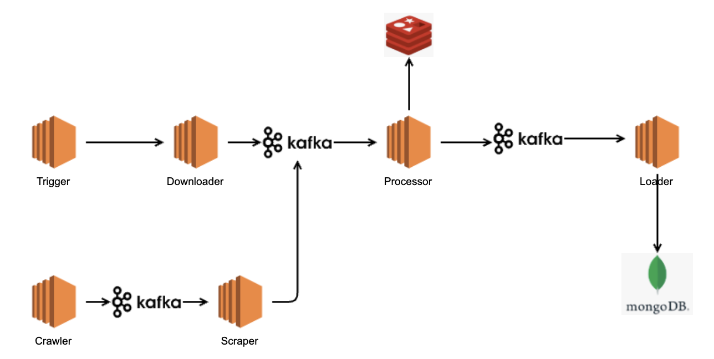

# 소개

우리가 왜 스트리밍으로 가려고 했는지?

Bounded Data와 Unbounded Data를 어떻게 핸들링 해야하는지에 대한 이해를 정리하고,

기존 아키텍처와 어떤 차이점이 있고 배치 프로세스와 스트리밍 프로세스에 대한 구조를 이해하고자 합니다.

# 아키텍처로의 스트리밍

일단 아키텍처로의 스트리밍은 애매한 영역이 있는 것 같습니다. 트리거 자체가 배치로 동작하다보니 오해할 수 있습니다. 제 생각에 배치와 스트리밍의 가장 큰 차이점은 내부적인 로직 자체가 DB에 의존하고 있는지 메세지를 보내서 처리할 수 있는지에 대한 차이점이 있는 것 같습니다.

배치 프로세스의 예시를 보면 일정 스케쥴이든, 트리거를 통해서 배치 프로세싱이 수행되면 나눠진 단계별로 배치 프로세싱이 수행됩니다. 그 과정속에서 DB에 내용을 바로 반영하고 다음 단계에서는 DB의 내용을 참고해서 작업을 수행합니다.

배치 프로세싱의 최대 단점은 지연시간입니다. 실시간 모니터링 시스템이나 장애 알림 솔루션들은 최대한 실시간으로 처리하기를 원합니다. 이를 극복하기 위해서 스트리밍 시스템이 나왔습니다.

스트리밍 시스템의 구조는 거의 배치 프로세싱과 흡사합니다. 가장 큰 차이점은 새로운 데이터가 들어오면 다음 단계로 처리하는 작업을 계속해서 수행합니다. 각 이벤트가 다음 단계로 처리가 되면 모든 단계가 끝난 후에 스토리지 시스템에 적재됩니다.

즉각적으로 각 단계가 수행되므로 선행 작업 완료에 대한 의존성이 낮습니다. 준실시간으로 처리할 수 있습니다.

# 우리가 전환을 생각한 이유

1. 낮은 확장성

   1건의 데이터 업데이트나 이미지 업데이트를 처리하기 위해서는 결국 반영하는데까지 최소 15분이 필요했습니다. 하지만 스트리밍 시스템을 도입하게되면 토픽에 메시지가 들어가는 순간 작동하여 즉각 처리를 보장할 수 있습니다.

   products 테이블에 CUD 작업할 서비스가 생길 경우, 새로운 임시 저장소 및 배치 스케쥴을 작성해야 합니다.

2. 높은 DB 의존성

   상품 diff 체크 및 삭제 상품 추출을 DB Join 쿼리를 이용해서 처리했습니다.

   캐시 역할을 하고 있지만 Vertica를 걷어내면 코드 변경이 많이 발생한다

3. 데이터 반영 지연

   상품이 1억개인 몰을 기준으로 정상 수행했을 경우 트래픽에 따라 달라지겠지만 거의 3시간이 걸립니다. 결국엔 Vertica Batch에 의해서 Upsert, Delete 스케쥴이 작동을 해야 DB에 반영이 됩니다.

4. 장애 발생에 유연하게 대처하지 못합니다

   EP를 다운 받아서 처리하는 도중 장애가 발생하면 담당자가 수동으로 재실행해야합니다.

# 개선을 통한 각 문제점 해결

1. 확장성

   몰 단위로 상품을 처리하는 것이 아니라 상품 단위로 처리하게 되면서 문제가 생기면 해당 module을 scale out하여 처리할 수 있다.

   CUD 처리 서비스 생성시 해당 서비스에서 Processor로 전송하는 카프카에 메시지만 보내주면 된다.

   상품 단위로 각 모듈별로 처리되는 즉시 DB에 반영된다.

2. 캐시 데이터 의존성

   Redis에 데이터가 존재하지 않더라고 실행 로직에 문제가 없다. (단, 캐시 데이터가 없을 경우 처리해야되는 상품 수량 증가)

3. 데이터 반영

   상품 단위로 즉각 반영되기 때문에 문제가 없다. 장애가 발생하더라도 발생 전까지의 데이터는 모두 처리 된다.

