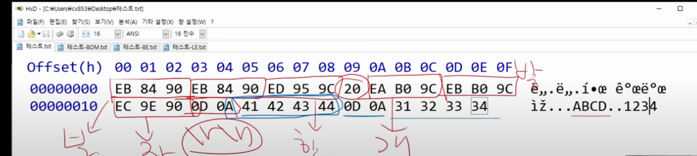

Ascii 코드는 7bit 체계로 이뤄짐 -> 2^7 = 128개만 사용가능

처음에는 영어랑 특수문자해봤자 얼마 안되기 때문에 128개로 표현할 수 있겠다고 생각했다.

그런데 컴퓨터를 전세계 사람들이 사용하게 되면서 128개로 모자라짐

-> 독일어, 프랑스어 까지는 ok 근데 중국어, 한글, 일본어 등 한자어 체계가 있으면 불가능함...

중국어는 거의 35000개, 일본어 20000개, 한글도 조합하면 11000개 가량 된다.

한글은 조합형과 완성형 중에 선택할 수 있었는데 완성형이 채택됐다.

대략 10만 이상이 필요하다고 해서 16비트를 쓰기로 했다. -> 2^16 =  65536개

마이크로소프트에서 MutiByteCharacterString MBCS를 만들었다가

CP949를 정의하면서, EUC-KR이 나왔다.

같이 인터넷이 급상승했다 , 그러면서 문자 인코딩이 문제가 됐다. html은 문선데 사용자마다 인코딩에 따라서 화면이 깨지는 경우가 발생했기 때문이다.

인코딩을 나중에 UTF-8으로 대동단결하게 된다.

Unicode를 3byte로 변경한다. 16bit -> 24bit

UTF 8은 ascii와 unicode를 같이 쓴다.

Code의 범위롤 보고 ascii 대역이 아니면 unicode를 16진수로 표현해서 쓴다.

UTF 8 (BOM)은 UTF-8이라는 것을 앞에 명시해준다.

UTF 16은 강제로 16bit로 늘려서 인코딩을 한다.

%로 나눠서 한글자씩 판단한다.

---

# Base64

- 기본적인 인코딩방식은 6bit로 값을 모두 나눠서 Base64에서 지원하는 64가지의 문자로 변환해서 값을 변환하는 것이다.
- 확장 Ascii는 8bit, UTF-8은 가변으로 1바이트부터 4바이트까지 지원하는데 이를 6비트로 나누게되면 오히려 문자열이 길어진다.
- 비효율적인 이 인코딩 방식은 언제 사용할까?
  1. URL 단축할 때 사용 -> 이를 해싱해서 사용한다.
  2. 인코딩 방식에 관계없이 바이너리 데이터를 안전하게 전달하기 위해서 사용된다.

