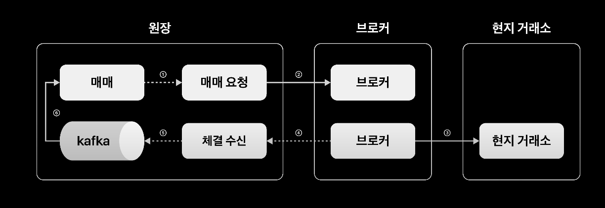
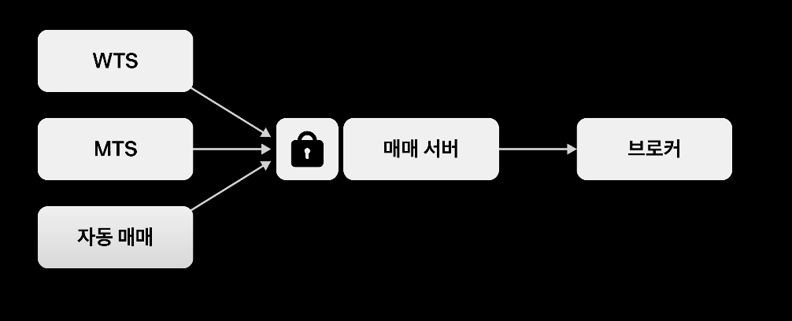
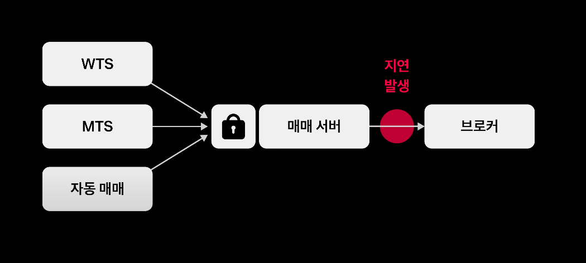
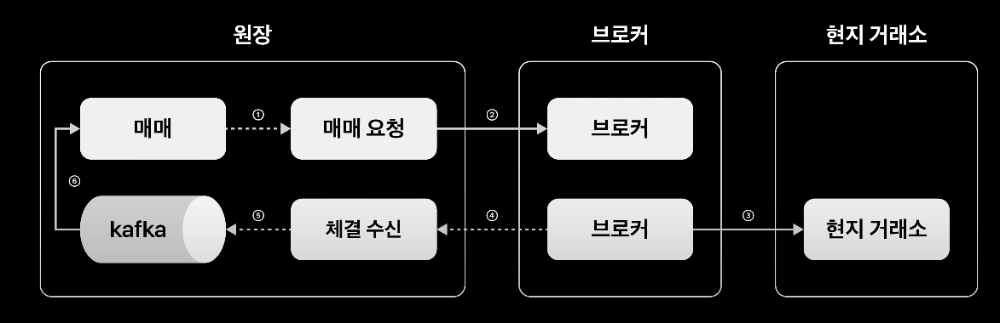

# 소개

주식을 거래할 때 어떤 일이 일어나는지?

내부에서 정합성을 맞추기 위해서 어떤 점을 고려해야하는지 관련해서 정리해봤습니다.

해당 [영상](https://www.youtube.com/watch?v=UOWy6zdsD-c)을 보고 내용을 요약했습니다.


# 아키텍처

주식매매는 아래와 같은 흐름으로 이뤄집니다.

```
클라이언트 - 게이트웨이 - 체널계 - 해외 원장 - 브로커 - 해외주식 거래소
```

대부분의 증권사에서는 해외 원장을 C 기반의 코드로 작성하고 있는데, 토스 증권은 SpringBoot, Kotlin, JPA를 기반으로 MSA 환경을 구축했다고 합니다. 필요시에는 Kafka, Redis를 통해서 대용량 트래픽을 처리하고 있다고 합니다.

먼저 전반적인 아키텍처를 살펴보면



클라이언트의 요청은 매매를 통해 이뤄지고 브로커와의 통신은 매매 요청 서버와 체결 수신 서버가 담당하고 있는 것을 확인할 수 있습니다. 이는 토스증권이 한국 법인으로 나스닥과 같은 해외 거래소와 직접 매매를 할 수 없기 때문입니다. 따라서 브로커를 통해서 매매가 이뤄지고 이에 대한 응답을 반환해주는 식으로 구성되어있습니다.

해당 아키텍처에서 발생할 수 있는 문제점을 살펴보고 토스증권에서는 어떻게 문제를 해결하고 있는지 알아보도록 하겠습니다.


# 동시성 문제



고객이 매매를 할 수 있는 수단은 여러가지고 매매 서버는 이를 받아서 브로커에게 전달해야하는 책임을 갖고 있습니다. DB를 대상으로 테이블에 락을 잡아 처리하게 된다면 동시성 문제는 해결할 수 있겠지만 성능이 저하되고, 혹시 하나의 트랜잭션이 무한정 진행된다면 데드락이 잡힐 수 있습니다. 추가로 MSA 구조나 분산된 환경에서 구성하게 된다면 서비스간 결합도가 높아지고 비효율적으로 자원을 사용하게 될 것 입니다.

토스 증권에서는 이를 해결하기 위해서 Redis 기반 분산락을 이용했다고 합니다. Redis 분산락을 사용하게 되면 원장에서 공통적으로 사용하기 때문에 하나의 트랜잭션이 길어졌을 때 다른 트랜잭션이 길어지는 문제가 있습니다. 또한 무한정 길어진다면 데드락이 발생할 수도 있습니다. 따라서  Lock에 timeout을 설정해서 의도치 않은 문제가 발생하지 않도록 해야합니다.

Timeout을 설정하면서 의도치 않은 문제가 발생할 수도 있습니다. 만약 트랜잭션이 종료되기 전에 락의 timeout이 지나버리면 다른 트랜잭션과 경합하게될 가능성이 있습니다. JPA를 쓰는 환경이라면 JPA 쓰기 지연으로 발생할 확률이 높습니다.

| no   | Tx1          | Tx2                  | 잔고    |
| ---- | ------------ | -------------------- | ------- |
| 0    | 락 획득      | 락 대기              | 2,000원 |
|      |              |                      |         |
| 1    | 락 Timeout   | 락 획득 & 500원 출금 | 1,500원 |
| 2    | 2,000원 출금 |                      | 0원     |

만약 트랜잭션 진행중이 Lock timeout이 발생하면 lock이 없는 트랜잭션이 커밋되고, Lost Update 문제가 발생할 수 있습니다. 이를 해결하기 위해서 몇가지 방안이 있습니다.

1. Atomic 연산
2. 명시적 잠금 (DB 락 사용)
3. Lost Update 자동 감지
4. Compare and Set 연산

2번은 살펴본 것처럼 비용이 너무 비싸고, 1번-3번은 DBMS에 의존적이다는 문제가 있습니다. 그래서 토스 증권에서는 4번 방식을 채택해서 사용하고 있다고 합니다. 이는 JPA를 사용하게 되면 낙관적 락을 통해서 쉽게 구현할 수 있습니다. 위와 같은 상황이 발생했을 경우 Tx1은 버전이 낮은 잔고를 수정하게 되고 이는 애플리케이션 단에서 실패 처리를 합니다. 따라서 갱신 유실 문제가 발생하지 않습니다.

그렇다면 분산락을 사용하지 않고 낙관적 락만 사용하면 어떻게 될까요? 낙관적 락만 사용하게 되면 재시도 로직에 대한 추가 구현이 필요합니다. 대부분의 상황에서는 분산락이 제대로 작동하므로 분산락을 기반으로 동시성 제어를 하고 혹시 모르는 timeout 관련된 문제를 방지하기 위해서 JPA의 낙관적 락을 걸어서 해결할 수 있습니다. 


# 해외구간 네트워크 지연



브로커는 해외에 있기 때문에 네트워크 지연이 발생할 수 있습니다. 만약 고객의 요청부터 브로커까지 하나의 쓰레드로 작업을 진행한다면 블락킹되어 최악의 경우 모든 스레드가 사용되어 더이상 요청을 받을 수 없게될 수도 있습니다.

이를 해결하기 위해서 고객의 요청을 받는 매매서버와 브로커에 매매 요청을 보내는 쓰레드를 분리하면서 해결했다고 합니다. 또한 매매서버에서 브로커로 요청을 보낼 때 동기로 처리하게 되면 시간 지연이 필연적이기 때문에 비동기처리로 성능을 개선했다고 합니다.

비동기로 처리를 하면서 주문 상태를 저장해놓을 필요가 생겼습니다. 매매서버에 주문 상태를 대기로 시작해서 비동기 응답에 따라 접수 성공, 접수 실패 상태로 변경해줍니다. 만약 브로커의 응답을 받지 못한 채 Timeout이 발생하면 브로커 요청의 식별값을 모르기 때문에 해당 주문상태는 파악 불가능하게 됩니다. 이러한 요청은 재시도 대상으로 판단합니다.

그런데 만약 해당 주문에 대해서 다시 요청을 보내게되면 브로커 측에서는 새로운 주문으로 식별하고 주문이 2개가 되어 정합성 문제가 발생할 수 있습니다. 이를 해결하기 위해서 멱등한 API 요청을 보낼 수 있도록 설정했습니다. 유일한 주문 ID 키를 보내서 하나의 주문 요청에는 하나의 브로커 주문이 생성될 수 있도록 구현했습니다.

만약 짧은 주기로 계속 반복하게 되면 네트워크 지연 상황을 더욱 악화 시킬 수 있습니다. 네트워크 지연으로 더 빈번한 타임 아웃이 발생할 수 있으므로 재시도 횟수만큼 지연 시간을 증가시키도록 구현했다고 합니다. 또한 횟수의 제한으로 지나친 요청이 일어나지 않도록 했습니다.


# 브로커 의존성 격리하기



브로커는 언제든지 추가되거나 변경될 수 있습니다. 만약 매매서버가 바로 브로커를 의존하고 있을 경우 브로커의 변경에 따라서 매매 서버에서 코드 변경도 불가피합니다. 매매와 관련된 도메인 로직은 매매서버에서 관리하고 요청을 보내는 매매 요청 서버를 통해 관리할 수 있도록 했습니다.

이를 통해 브로커가 장애가 나더라도 토스의 매매 서버는 안전해질 수 있고 매매 요청 서버의 scale out을 통해 브로커에 대응하여 요청을 늘릴 수 있습니다.

마찬가지로 브로커에서 토스로 들어오는 Inbound 트랜잭션들을 처리하는 체결 수신 서버가 있습니다. 체결 수신 서버는 브로커의 응답을 받아 DB에 저장하고 Kafka에 메시지를 발행합니다. 매매서버가 바쁜 상황이라고 하더라도 메시지를 수신하지 못하는 문제를 방지할 수 있고, 혹시 카프카가 죽더라도 다양한 Fail Over 전략으로 메시지 유실 없이 선택할 수 있습니다. 또한 브로커에 의존하지 않는 중복 이벤트를 처리하기 위해 유일한 아이디를 발급하여 브로커 파트너사에서 여러개의 중복값을 주더라도 매매 서버는 유일한 값만 받을 수 있습니다.


# 정리

토스 증권에서 어떻게 해외 주식 거래가 이뤄지는지 거시적으로 알아볼 수 있었습니다. 해외 주식 특성상 브로커와의 연결, 주문하는 방식에 맞춰서 고려해야할 사항들이 많았습니다. 어떻게 동시성 이슈를 해결하고 의존성을 분리하여 안정된 아키텍처를 설계했는지 알아볼 수 있었습니다.


#### Reference

https://www.youtube.com/watch?v=UOWy6zdsD-c